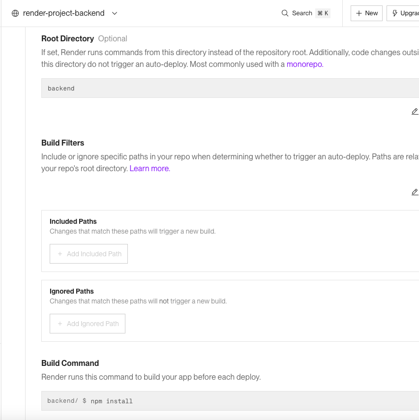

```pgsql
render-project/
├── backend/
│   ├── .env
│   ├── package.json
│   └── README.md
│
├── frontend/
│   ├── .env
│   ├── vite.config.js
│   ├── package.json
│   └── README.md
│
├── .gitignore
└── README.md
```


.gitignore en render-project:

```
# Root-level ignores
.DS_Store
node_modules/

# Backend
/backend/node_modules/
/backend/.env
/backend/dist/
/backend/logs/

# Frontend
/frontend/node_modules/
/frontend/.env
/frontend/build/
```


# Backend

Express - backend

```json

{
  "name": "backend",
  "version": "1.0.0",
  "description": "",
  "main": "index.js",
  "type": "module",
  "scripts": {
    "start": "node index.js",
    "dev": "nodemon index.js"
  },
  "keywords": [],
  "author": "",
  "license": "ISC",
  "dependencies": {
    "cors": "^2.8.5",
    "express": "^5.1.0",
    "express-validator": "^7.2.1"
  },
  "devDependencies": {
    "nodemon": "^3.1.9"
  }
}

```

y hacer un npm install

---
# VITE - front end
```bash
npm create vite@latest .
```
y hacer un npm install


# Render
Crear un render.yml en colocar en directorio raiz


```bash
git init
git branch -m main
git add .
git commit -m "Initial commit"
```


Crear un nuevo repo en github:
```bash
git remote add origin https://github.com/xxxxx/render-project.git
git branch -M main
git push -u origin main
```


# RENDER

Front end


Back end




front end
dist

Cambiar fetch:
https://render-project-backend.onrender.com/


```js
app.use(cors({ origin: '*' }));  // specify ruta aqui
```

OR 


```js
const allowedOrigins = ['https://render-project-frontend.onrender.com'];

app.use(cors({
  origin: function(origin, callback){
    // allow requests with no origin (like curl, postman)
    if(!origin) return callback(null, true);
    if(allowedOrigins.indexOf(origin) === -1){
      const msg = `The CORS policy for this site does not allow access from the specified Origin.`;
      return callback(new Error(msg), false);
    }
    return callback(null, true);
  },
  credentials: true, // if you need to send cookies/auth headers
}));

```