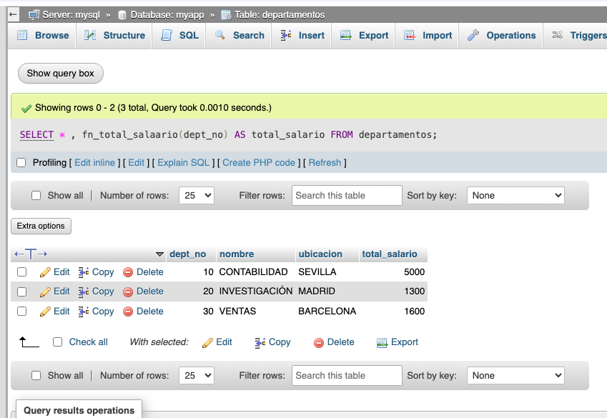

docker-compose up --build

```bash
>> docker exec -it mysql-db bash
>> mysql -u user -p
```

Usando mysql consola interfaz:

```sql
SHOW DATABASES;

USE insertar_db;
SHOW TABLES;
```

## PHP MY ADMIN
http://localhost:8081/


```sql
USE myapp;

CREATE TABLE departamentos (
  dept_no INT PRIMARY KEY,
  nombre VARCHAR(50) NOT NULL,
  ubicacion VARCHAR(50)
);

-- Create empleados table
CREATE TABLE empleados (
  emp_no INT PRIMARY KEY,
  nombre VARCHAR(50) NOT NULL,
  puesto VARCHAR(50),
  jefe INT,
  fecha_contratacion DATE,
  salario DECIMAL(10, 2),
  comision DECIMAL(10, 2),
  dept_no INT,
  FOREIGN KEY (dept_no) REFERENCES departamentos(dept_no)
);

-- Insert sample departments
INSERT INTO departamentos (dept_no, nombre, ubicacion) VALUES
(10, 'CONTABILIDAD', 'SEVILLA'),
(20, 'INVESTIGACIÓN', 'MADRID'),
(30, 'VENTAS', 'BARCELONA');

-- Insert sample employees
INSERT INTO empleados (emp_no, nombre, puesto, jefe, fecha_contratacion, salario, comision, dept_no) VALUES
(7369, 'SMITH', 'EMPLEADO', 7902, '2020-12-17', 800.00, NULL, 20),
(7499, 'ALLEN', 'VENDEDOR', 7698, '2021-02-20', 1600.00, 300.00, 30),
(7839, 'KING', 'PRESIDENTE', NULL, '2019-11-17', 5000.00, NULL, 10);


```

# Tablas

1. Crear una table *motor de almacenamiento de CSV*

Entrar en el contenedor de Docker para ver los archivos CSV:

```bash
/var/lib/mysql/mydb/
```

Buscamos la informacion de metadatos sobre esta tabla:
```sql
SELECT * FROM `TABLES`
WHERE TABLE_NAME = 'csv_example'
```

2. Crear una table con *motor de almacenamiento de ARCHIVE*

Intentar borrar datos

3. Crear una table **motor de almacenamiento de IN MEMORY*

```sql
SELECT * FROM paises;

INSERT INTO  paises (id, nombre)
VALUES (1, 'España'),
(2, 'Australia');
```

Simulamos una parada  del servicio de MySQL y volvemos a ver los datos
```bash
$ docker stop mysql-db
$ docker start mysql-db
```


# Rutinas

- funciones
- procedimientos almacenados

Para crear rutinas:

MySQL said: Documentation

#1419 - You do not have the SUPER privilege and binary logging is enabled (you *might* want to use the less safe log_bin_trust_function_creators variable)

```bash
mysql -u root -p   # rootpass


mysql> SET GLOBAL log_bin_trust_function_creators = 1;
```

## Funciones
```sql
DELIMITER $$

CREATE FUNCTION fn_count_empleados(i_deptno INT)
RETURNS INT
DETERMINISTIC
READS SQL DATA
BEGIN
    DECLARE total INT;

    SELECT COUNT(*) INTO total
    FROM empleados
    WHERE dept_no = i_deptno;

    RETURN total;
END$$

DELIMITER ;

```

Una función o procedimiento **determinístico** siempre devuelve el mismo resultado cuando se le pasan los mismos valores de entrada, sin importar cuándo o cuántas veces se ejecute.

los LLM como ChatGPT son **NO** determinísticos por naturaleza, y esto es intencional, porque les permite generar texto más variado y natural. 

```sql
CREATE FUNCTION sumar_uno(x INT)
RETURNS INT
DETERMINISTIC
BEGIN
    RETURN x + 1;
END
```

# Actividad - funciones





# Procedimientos Almacenados

```sql
BEGIN
	SELECT * FROM empleados
    WHERE emp_no = i_emp_no;
END
```

Y lo ejecutamos con
```sql
SET @emp_no = 7365;

CALL usp_get_empleado(@emp_no);
```

Operaciones de INSERT, UPDATE y DELETE:

```sql
CREATE PROCEDURE `usp_insert_dept`(IN `i_deptno` INT, IN `i_nombre` VARCHAR(200), IN `i_ubicacion` VARCHAR(200)) 
NOT DETERMINISTIC 
MODIFIES SQL DATA 
SQL SECURITY DEFINER 
BEGIN 
    INSERT INTO departamentos (dept_no, nombre, ubicacion) VALUES (i_deptno, nombre, i_ubicacion); 
END
```

# Actividad - procedimientos almacenados

Crear un procedimiento almacenado tipo *UPSERT* que actualizar los datos si la clave existe, y si no, inserta una nueva fila.
PISTA el siguiente formato:
```sql 
    IF EXISTS () THEN

    ELSE

    END IF;

```
Lo puedes ejecutar con este formato:
```sql
SET @deptno = 10;
SET @nombre = 'Contabilidad';
SET @ubicacion = 'Madrid';

-- Call the procedure using the variables
CALL us_upsert_departamento(@deptno, @nombre, @ubicacion);
```


## PHP con procedimientos almacenados

Adaptar este ejemplo para ejecutar un procedimiento almacenado en PHP

```php
<?php
// Connect to MySQL
$mysqli = new mysqli("localhost", "user", "password", "database");

if ($mysqli->connect_error) {
    die("Connection failed: " . $mysqli->connect_error);
}

// The stored procedure name and parameters
$procedureName = "usp_get_empleado";
$emp_no = 7365;

// Prepare the CALL statement with a placeholder
$stmt = $mysqli->prepare("CALL $procedureName(?)");

if (!$stmt) {
    die("Prepare failed: " . $mysqli->error);
}

// Bind parameters (assuming emp_no is integer)
$stmt->bind_param("i", $emp_no);

// Execute the procedure
$stmt->execute();

// Get result set from procedure
$result = $stmt->get_result();

if ($result) {
    while ($row = $result->fetch_assoc()) {
        print_r($row);  // or do something with the row
    }
    $result->free();
} else {
    echo "No results or error: " . $mysqli->error;
}

// Close statement and connection
$stmt->close();
$mysqli->close();
?>

```

Para incluir más paramatros, usar:
```php
// Bind parameters: i = integer, s = string
$stmt->bind_param("iss", $dept_no, $nombre, $ubicacion);
```

# Respuestas
```sql

BEGIN
	DECLARE total INT;

    SELECT SUM(salario) INTO total
    FROM empleados
    WHERE dept_no = i_deptno;

	RETURN total;
 END


-- version 1

BEGIN

	IF EXISTS(SELECT 1 FROM departamentos WHERE dept_no = i_deptno) THEN
    	INSERT INTO departamentos (dept_no, nombre, ubicacion)
		VALUES (i_deptno, nombre, i_ubicacion);
    ELSE
    	UPDATE departamentos
        SET nombre = i_nombre,
        	ubicacion = i_ubicacion
        WHERE dept_no = i_deptno;
	END IF;

END


-- version 2
CREATE PROCEDURE usp_upsert_departamento (
    IN i_deptno INT,
    IN i_nombre VARCHAR(200),
    IN i_ubicacion VARCHAR(200)
)
MODIFIES SQL DATA
BEGIN
    INSERT INTO departamentos (dept_no, nombre, ubicacion)
    VALUES (i_deptno, i_nombre, i_ubicacion)
    ON DUPLICATE KEY UPDATE
        nombre = VALUES(nombre),
        ubicacion = VALUES(ubicacion);
END $$

DELIMITER ;
```