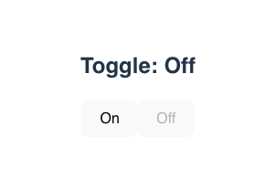

# Reducers

## ¿Qué es un reducer?
Un reducer es una función que recibe dos cosas:

```jsx
(state, action) => newState
```

- state: el estado actual.

- action: un objeto que describe qué queremos hacer (normalmente tiene una propiedad type y puede tener payload).

## Casos comunes de uso para reducers
✅ Contadores:
Aumentar o disminuir un número con botones.

Ejercicio clásico para comenzar.

🔀 Toggles (activado/desactivado):
Mostrar u ocultar un modal, menú o cambiar un botón entre ON/OFF.

📋 Formularios complejos:
Guardar múltiples campos de un formulario.

Validaciones y cambios en cascada entre campos.

🧮 Carritos de compras:
Añadir, quitar y actualizar productos.

Calcular totales, aplicar cupones.

🗂️ Manejo de múltiples estados interrelacionados:
Como en una app de tareas, donde cada tarea puede cambiar su estado individual.

🔄 Estados que dependen del anterior:
Cuando la actualización depende de la versión anterior del estado.


## Actividad




## Respuesta

```jsx
import { useReducer } from "react";

// Paso 1: Definir la funcion reducer
const reducer = (state, action) => {
  switch (action.type) {
    case 'on':
      return { isOn: true };
    case 'off':
      return { isOn: false };
    default:
      throw new Error('Unknown action type');
  }
}

// Paso 2: asignar el estado inicial
const initialState = { isOn: false };

const ReducerToggle = () => {
  const [state, dispatch] = useReducer(reducer, initialState);
    /* 
        state es igual a count = getter
        dispatch es la accion/boton para cambiar el state
    */
  return (
    <div style={{ textAlign: 'center', fontFamily: 'sans-serif' }}>
      <h2>Toggle: {state.isOn ? 'On': 'Off'}</h2>
      <button onClick={() => dispatch({ type: 'on' })} disabled={state.isOn == true}>On</button>
      <button onClick={() => dispatch({ type: 'off' })} disabled={state.isOn == false}>Off</button>
    </div>
  );
}

export default ReducerToggle;
```