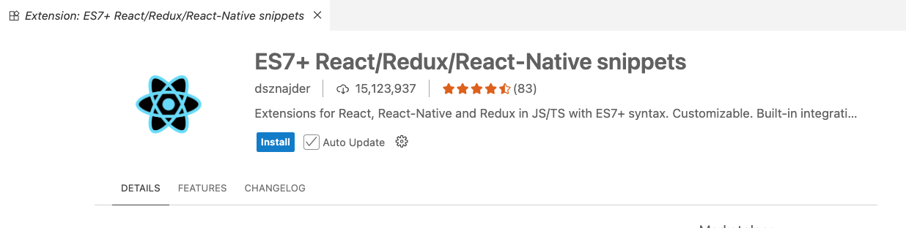
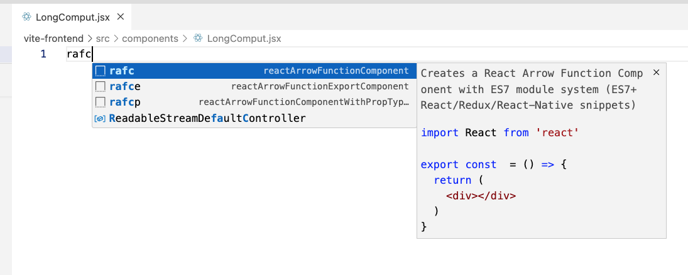
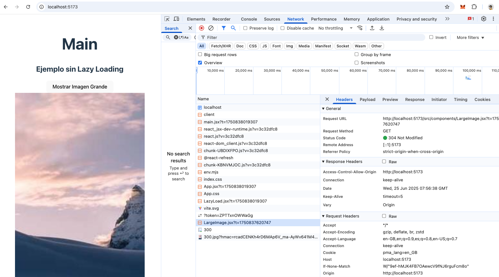

# Rendimiento
Vamos a apredner algunas técnicas para mejorar el rendimiento de un proyecto front-end de ReactJs.





https://github.com/r5n-labs/vscode-react-javascript-snippets/blob/HEAD/docs/Snippets.md


# UseMemo

useMemo es un hook de React que sirve para memorizar el resultado de una función y evitar que se vuelva a calcular si las dependencias no han cambiado.


**¿Por qué es útil?**
En React, cada vez que un componente se vuelve a renderizar, todo el código dentro de su función se ejecuta otra vez.
Si tienes una operación pesada (por ejemplo, filtrar una lista grande, hacer cálculos complejos, ordenar muchos datos), hacerlo en cada render puede hacer que la app vaya lenta.

Aquí entra useMemo: te permite que esa operación solo se ejecute cuando cambien ciertos datos de los que depende, y si no, reutiliza el resultado guardado (cacheado).


```jsx

import React, { useState} from 'react'


function sumarTo(x) {
  console.log("doing long compute");
    let total = 0;
    for (let index = 0; index < x; index++) {
      total = total + index;
    }
    return total;
}

export const  LongComput = () => {
  const [greeting, setGreeting] = useState('Hola');

  console.log("re-render");

  let longComput =  sumarTo(100);
 
  return (
    <>
      <h1>Long Comput</h1>
    
      Result is: {longComput}

      {greeting}
      <button onClick={(e)=> setGreeting('Adios')}>Greeting</button>
    </>
  )
}


```

## Solucion con UseMemo
```jsx
import React, { useEffect, useState, useMemo} from 'react'

let longComput = useMemo(() => sumarTo(100), []);
```
 

useMemo: memoriza el resultado de la función y devuelve el valor directamente dentro del render. No genera un estado adicional.

useEffect + estado: ejecuta un efecto que actualiza un estado (filteredUsers), provocando un render adicional cuando cambia.


# Lazy loading (carga perezosa)

Lazy loading (carga perezosa) es una técnica que consiste en no cargar o descargar ciertos recursos (como componentes o imágenes) hasta que realmente se necesitan.

En React, esto se usa con React.lazy y Suspense para cargar componentes bajo demanda y mejorar el rendimiento.



React.lazy(() => import('./LargeImage')) hace que el componente LargeImage se cargue solo cuando se necesite, es decir, cuando se renderice realmente.

Importar Suspense permite mostrar algo (un fallback) mientras el componente se está cargando.

React lazy + Suspense = “load this component only when you really need it” + “show fallback UI meanwhile.”

```jsx
import React, { useState, Suspense } from 'react';
const LargeImage = React.lazy(() => import('./LargeImage'));

<button onClick={() => setShowImage(true)}>Mostrar Imagen Grande</button>

<Suspense fallback={<div>Cargando imagen...</div>}>
    {showImage && <LargeImage />}
</Suspense>


```


# ¿Qué es React Query?
React Query es una biblioteca para manejar datos remotos (como APIs) en aplicaciones React. Su objetivo principal es facilitar la obtención, almacenamiento en caché, sincronización y actualización de datos que vienen de servidores o servicios externos.

```jsx
import { useQuery } from '@tanstack/react-query';

function fetchUsers() {
  return fetch('https://api.example.com/users').then(res => res.json());
}

export function UserList() {
  const { data, isLoading, error } = useQuery(['users'], fetchUsers);

  if (isLoading) return <div>Cargando...</div>;
  if (error) return <div>Error al cargar usuarios</div>;

  return (
    <ul>
      {data.map(user => (
        <li key={user.id}>{user.name}</li>
      ))}
    </ul>
  );
}

```

 ## Respuestas

 ```jsx
   const filteredUsers = useMemo(() => {
    console.log('Filtering users...');
    return users.filter(user =>
      user.name.toLowerCase().includes(search.toLowerCase())
    );
  }, [search]);

  ```