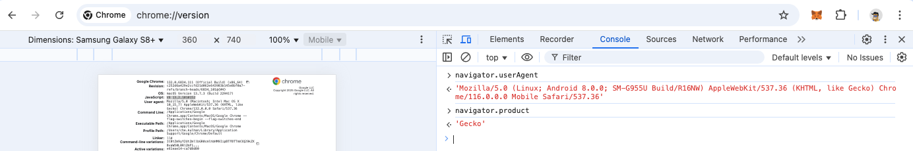

# Introducción a Node.js

Node.js es un entorno de ejecución para JavaScript en el lado del servidor, basado en el motor V8 de Google Chrome. Permite ejecutar código JavaScript fuera del navegador, lo que abre la posibilidad de desarrollar aplicaciones backend, servidores web, y mucho más.

## Instalación

### 1. Descargar Node.js
Ve al sitio web oficial de [Node.js](https://nodejs.org/) y descarga la versión recomendada para la mayoría de los usuarios, que incluirá tanto Node.js como npm (el gestor de paquetes de Node).

### 2. Verificar la instalación
Una vez descargado e instalado, abre la terminal o línea de comandos y escribe:

```bash
node -v
node --version
```
Esto debería mostrarte la versión de Node.js instalada. Para verificar la versión de npm, usa:

```bash
npm -v
```
Uso de Node.js en la REPL (Read-Eval-Print-Loop)
Node.js permite ejecutar código JavaScript directamente desde la línea de comandos. Para empezar con la REPL, abre la terminal y escribe:

```bash
node
```

Verás que el prompt cambia y ahora puedes escribir código JavaScript y ejecutarlo inmediatamente:

```bash
> console.log('Hola, Mundo!');
```

Cuando termines de trabajar en la REPL, puedes salir escribiendo:
```bash
.exit
```
Primeros pasos con Node.js en VS Code


Usando Chrome, chrome://version/


## Proyecto 1: Uso de herramientas de REPL / linea de comandos
Los estudiantes deben crear un programa en JavaScript que realice las operaciones matemáticas básicas (suma, resta, multiplicación y división) utilizando dos números hard-coded (predefinidos). El programa deberá mostrar el resultado de cada operación en la consola.

Primeras dos líneas del código:
```javascript
let num1 = 12;
let num2 = 4;
```
A partir de estas dos líneas, el estudiante debe realizar las operaciones y mostrar los resultados utilizando console.log(). 

Hay que ejecutar el programa desde la linea de comandos, usando:
```bash
> node calculadora.js
```

# Conclusión
Node.js es una herramienta poderosa que te permite ejecutar JavaScript fuera del navegador, ideal para desarrollar aplicaciones backend. A partir de estos primeros pasos, puedes seguir explorando su uso para crear servidores web, APIs, o aplicaciones en tiempo real.

