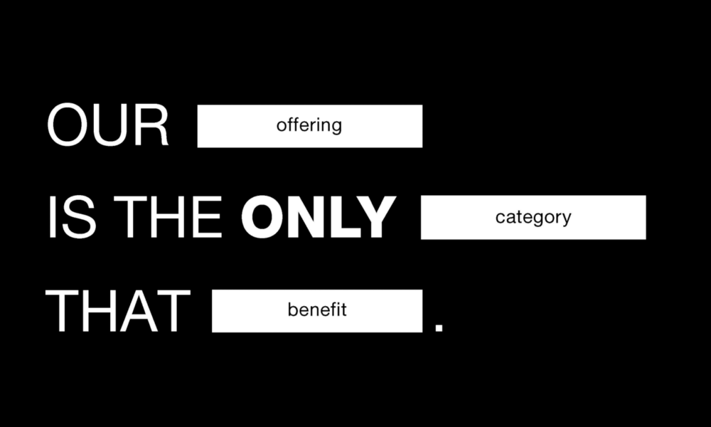
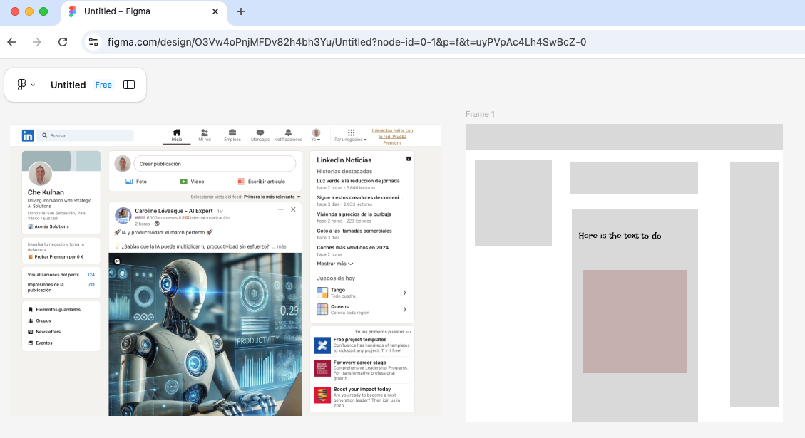

# Tipos de Diseño en Desarrollo Web
## Diseño orientado al usuario
Se enfoca en la experiencia del usuario, asegurando que la navegación sea intuitiva, accesible y eficiente. Se prioriza la usabilidad y la accesibilidad para diferentes dispositivos y capacidades.

Ejemplo: Un portal de banca en línea que facilita la consulta de saldos y transferencias con una interfaz sencilla y clara.

## Diseño orientado a objetivos
Busca cumplir con un propósito específico, alineando la estructura y elementos de la web con las metas del negocio o proyecto. Se optimiza para conversiones, generación de leads o ventas.

Ejemplo: Una página de registro para un evento donde el formulario de inscripción y la llamada a la acción están bien posicionados para maximizar inscripciones.

## Diseño orientado a la implementación
Se enfoca en la viabilidad técnica del desarrollo web, asegurando que el diseño sea fácil de implementar, mantener y escalar. Se prioriza el uso de tecnologías eficientes y buenas prácticas de código.

Ejemplo: Un sistema de gestión interna basado en componentes reutilizables de React, optimizado para actualizaciones rápidas y bajo consumo de recursos.
En un buen diseño web, estos tres enfoques deben combinarse para lograr una experiencia de usuario óptima, cumplir con los objetivos del negocio y garantizar una implementación eficiente.

# Actividad: Comparar las siguientes páginas webs y comentar
- Air BNB
- Lings Cars
- Stripe
- Medium (medium.com)
- https://www2.pnwx.com/
- https://thebiguglywebsite.com/
- https://arngren.net/
- Craigs List
- Amazon
- https://www.berkshirehathaway.com/

# Proceso de Diseño Web
[Download PDF](../x-assets/UF1841/proceso-diseno-pagina-web.pdf)

## Ejemplos:
- https://duck.design/effective-website-design-process/

# Digitial Marketing en el proceso de diseño de una aplicación web
## USP (Unique Selling Proposition o Unique Selling Point)
El USP es lo que hace que un producto o servicio sea único y diferente de la competencia. Se trata de un beneficio clave que atrae a los clientes y los convence de elegir tu producto en lugar de otro.

🔹 Ejemplo:

Domino’s Pizza: “Pizza caliente y fresca en 30 minutos o es gratis.”
Colgate Total: “Protección completa para tu boca durante 12 horas.”
En estos ejemplos, el valor diferencial está en la rapidez de entrega o en la duración de la protección dental.

## Onliness Statement
El Onliness Statement es un concepto desarrollado por Marty Neumeier en su libro Zag. Es una declaración que define lo que hace que una marca sea única, sin comparación directa con otras.

Se construye con la siguiente estructura:

Nuestra [marca] es la única [categoría] que [beneficio principal o característica única].

🔹 Ejemplo:

Tesla: "Tesla es la única marca de automóviles que ofrece vehículos eléctricos de lujo con una red global de carga rápida y tecnología de conducción autónoma avanzada."
GoPro: "GoPro es la única cámara de acción que combina resistencia extrema, calidad de video profesional y una comunidad global de creadores de contenido extremo."
Mientras que el USP destaca una característica clave, el Onliness Statement define la identidad única de la marca dentro de su categoría.

# Wireframes
Un wireframe es un esquema visual o boceto de una página web o aplicación que muestra la estructura y disposición de los elementos sin enfocarse en el diseño final, colores o imágenes. Su propósito es representar de manera clara y sencilla cómo se organizará el contenido y la funcionalidad de una interfaz.

## ¿Para qué se usa?
- Planificación del diseño – Ayuda a definir la estructura y jerarquía de la información antes de entrar en detalles visuales.
- Facilitar la comunicación – Sirve como referencia para diseñadores, desarrolladores y clientes, asegurando que todos estén alineados en cuanto a la estructura.
- Optimización de la usabilidad – Permite detectar problemas en la experiencia del usuario (UX) antes de invertir tiempo y recursos en el desarrollo final.
- Ahorro de tiempo y costos – Evita cambios costosos en fases avanzadas del desarrollo al validar la estructura desde el inicio.

Los wireframes pueden ser creados a mano o con herramientas como Figma, Adobe XD, Balsamiq, Sketch o incluso en papel.

# Actividad FIGMA wireframe
Vas a copiar una página ewb que te guste, y diseñar un wireframe usando FIGMA.

Presentar tu wireframe a la clase, considerando el USP o Onliness statement.

# Referencias
- Simon Sinek: Purpose Driven Organisation
- [Marty Neumeier](https://www.martyneumeier.com/the-onlyness-test) 
- Figma
- [Design Thinking](https://designthinking.ideo.com/)