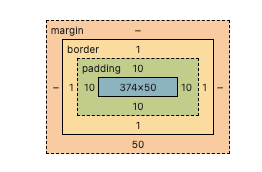

# CSS

CSS (Cascading Style Sheets) es un lenguaje utilizado para describir la presentación de un documento escrito en HTML o XML. Permite controlar la apariencia de los elementos, como colores, fuentes, márgenes y más. Fue creado en 1996 por Håkon Wium Lie y Bert Bos con el objetivo de separar el contenido de la presentación en la web. Esto permitió un diseño más flexible y eficiente. A lo largo de los años, CSS ha evolucionado, agregando nuevas propiedades y características que mejoran la accesibilidad, la usabilidad y la estética de las páginas web.

## 1. color
Descripción: Establece el color del texto.
Ejemplo:
```css
  p {
    color: red;
  }
``` 

## 2. background-color
Descripción: Establece el color de fondo de un elemento.
Ejemplo:
```css
body {
  background-color: lightblue;
}
```

## 3. font-size
Descripción: Define el tamaño de la fuente del texto.
Ejemplo:
```css
h1 {
  font-size: 24px;
}
```

## 4. font-family
Descripción: Define el tipo de fuente del texto.
Ejemplo:
```css
p {
  font-family: Arial, sans-serif;
}
```

## 5. margin
Descripción: Añade espacio fuera de un elemento, creando márgenes alrededor de él.
Ejemplo:
```css
div {
  margin: 20px;
}
```

## 6. padding
Descripción: Añade espacio dentro de un elemento, creando relleno alrededor de su contenido.
Ejemplo:
```css
button {
  padding: 10px 20px;
}
```

## 7. border
Descripción: Añade un borde alrededor de un elemento.
Ejemplo:
```css
div {
  border: 1px solid black;
}
```

## 8. width y height
Descripción: Define el ancho y alto de un elemento.
Ejemplo:
```css
img {
  width: 100%;
  height: auto;
}
```

## 9. text-align
Descripción: Alinea el texto dentro de un elemento (izquierda, derecha, centro).
Ejemplo:
```css
h2 {
  text-align: center;
}
```
## 10. display
Descripción: Define cómo se muestra un elemento en la página (block, inline, etc.).
Ejemplo:
```css
span {
  display: inline-block;
}
```

# Resumen de CSS
CSS (Cascading Style Sheets) es un lenguaje que permite dar estilo y formato a los documentos web. Creado en 1996 por Håkon Wium Lie y Bert Bos, CSS permite separar el contenido de la estructura visual, mejorando la accesibilidad y la flexibilidad en el diseño. A lo largo del tiempo, CSS ha evolucionado con nuevas propiedades y características, permitiendo a los desarrolladores crear páginas web más dinámicas, interactivas y atractivas.




# Recursos
(Adobe Color Wheel)[https://color.adobe.com/]