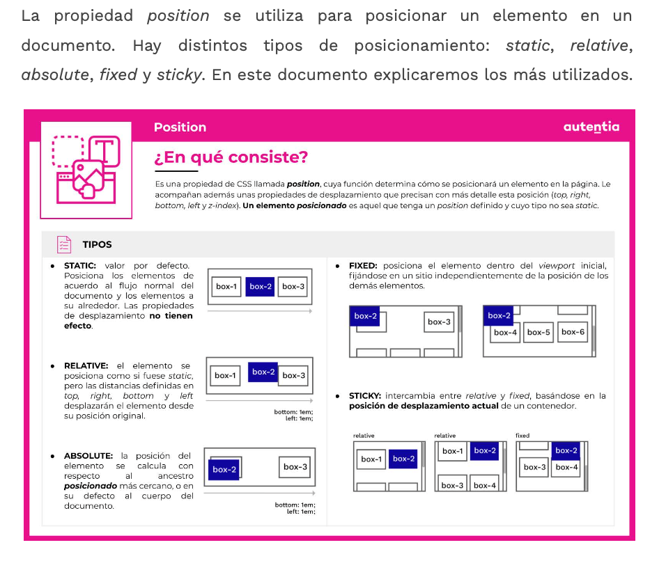
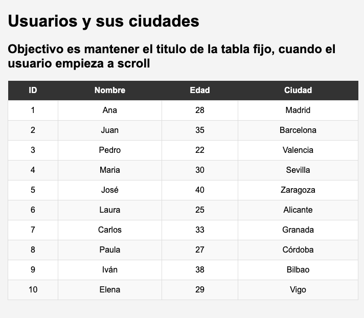
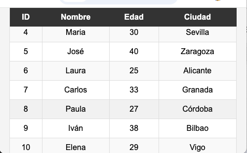

# Position

Resumen de los Valores de position:
**static**: Es el valor predeterminado. El elemento se coloca en el flujo normal del documento.
**relative**: El elemento se coloca según el flujo normal, pero puedes moverlo con top, right, bottom, left.
**absolute**: El elemento se posiciona respecto al contenedor más cercano con una posición distinta de static.
**fixed**: El elemento se posiciona respecto a la ventana del navegador y permanece fijo mientras haces scroll.
**sticky**: El elemento se comporta como relative hasta que se hace scroll, luego se queda fijo en su lugar.

## Actividad 1
Queremos emular una página de ChatGPT, con HTML y CSS básico. Usar los elementos position, overflow-y para hacer lo más parecido a esta imágen:

## Actividad 2
Al scroll, queremos que el usuario sigue viendo la primera fila (th) de la tabla. 

