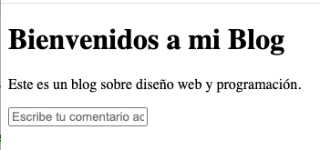
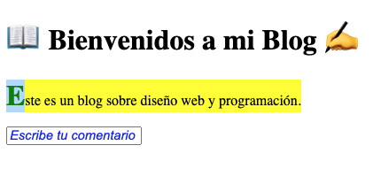

# ¿Qué son los pseudo-elementos en CSS?
Los pseudo-elementos en CSS permiten aplicar estilos a una parte específica de un elemento sin necesidad de modificar el HTML. Se escriben con :: antes del nombre del pseudo-elemento.

Principales pseudo-elementos en CSS
- ::before – Agrega contenido antes del elemento.
- ::after – Agrega contenido después del elemento.
- ::first-letter – Estiliza la primera letra de un texto.
- ::first-line – Estiliza la primera línea de un párrafo.
- ::selection – Cambia el estilo del texto seleccionado por el usuario.

```css
p::before {
  content: "👉 ";
  color: red;
}

p::after {
  content: " 🔥";
  color: orange;
}
```

# Actividad






El contenido en amarillo esta seleccionado.

# Recursos
[Before y After](https://www.youtube.com/watch?v=dIUOWdwwZBw)
[Antes](https://developer.mozilla.org/es/docs/Web/CSS/::before)
[Despues](https://developer.mozilla.org/es/docs/Web/CSS/::after)