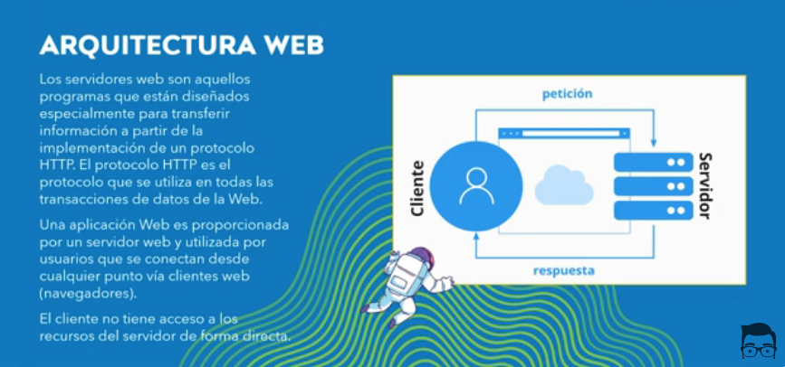
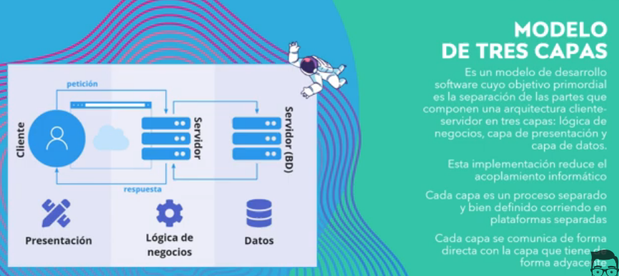
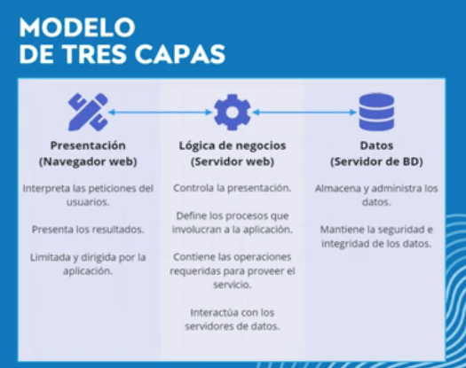

## Ventajas:

1. Separation of Concerns (Separación de Responsabilidades)
Ventaja: Cada capa tiene una responsabilidad claramente definida, lo que facilita el mantenimiento y mejora la modularidad.
Ejemplo: En una aplicación web, podrías tener una capa de presentación (UI), una capa de lógica de negocio (funcionalidad de la aplicación), y una capa de acceso a datos (base de datos). Si necesitas cambiar la interfaz de usuario, no afecta directamente a la lógica de negocio ni a la base de datos.
2. Facilidad de Mantenimiento (Modularidad)
Ventaja: Al estar separadas las capas, es más fácil hacer modificaciones sin afectar otras partes del sistema.
Ejemplo: Si necesitas cambiar la lógica de negocio de una aplicación, puedes hacerlo en la capa correspondiente sin necesidad de modificar la capa de presentación o la capa de datos, lo que reduce el riesgo de introducir errores en otras partes del sistema.
3. Escalabilidad y Flexibilidad
Ventaja: La arquitectura de capas permite agregar nuevas funcionalidades o escalar diferentes componentes sin afectar al resto del sistema.
Ejemplo: Si tu aplicación necesita manejar un mayor volumen de datos, puedes optimizar la capa de acceso a datos (por ejemplo, cambiando a una base de datos más robusta o distribuyendo la carga en servidores adicionales) sin modificar la capa de presentación o lógica de negocio.
4. Reusabilidad
Ventaja: Puedes reutilizar capas en otros proyectos o contextos sin necesidad de reescribir todo el código.
Ejemplo: La capa de acceso a datos que maneja la conexión con una base de datos podría ser reutilizada en diferentes aplicaciones que requieran la misma funcionalidad sin tener que duplicar el código.
5. Facilidad de Pruebas y Depuración
Ventaja: Al tener capas separadas, es más fácil realizar pruebas unitarias y depurar el sistema.
Ejemplo: Puedes probar cada capa de manera independiente. Por ejemplo, puedes probar la capa de lógica de negocio sin necesidad de interactuar con la base de datos o la interfaz de usuario. Esto facilita la identificación de errores en cada componente de forma aislada.

## Express como architectura de capas
- Capa de Presentación: Archivos HTML en la carpeta de vistas.
- Capa de Activos Estáticos: Archivos en la carpeta pública (CSS, JavaScript, imágenes).
- Capa de Aplicación: Rutas de Express que manejan las solicitudes, la lógica de negocio y el manejo de respuestas.
- Capa de Datos: No mostrada explícitamente, pero esta capa interactuaría con tu base de datos (por ejemplo, MongoDB, PostgreSQL).
- Capa de Middleware: Middleware para registro y manejo de errores.

A medida que la aplicación crece, podrías querer refactorizarla en módulos separados, usar patrones MVC (Modelo-Vista-Controlador) o dividir más las preocupaciones en capas y servicios específicos.

Esta arquitectura fomenta la separación de preocupaciones (separation of concerns), lo que hace que tu aplicación sea más fácil de gestionar, ampliar y probar.

# Referencias
[Web Capas](https://www.youtube.com/watch?v=G-yJxSdUHx0)
