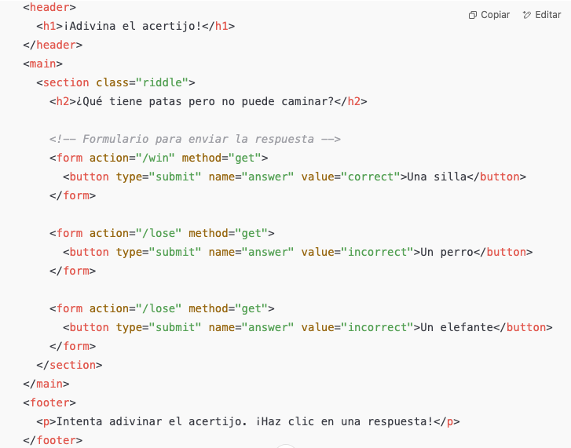

# Servir Archivos Estáticos
express.static() se utiliza para servir archivos estáticos como CSS, JavaScript e imágenes. Al usar este middleware, no es necesario enviar estos archivos manualmente para cada ruta; Express manejará automáticamente las solicitudes para estos archivos.

```javascript
app.use(express.static(path.join(__dirname, 'public')));
```

Servir Archivos HTML: Utiliza res.sendFile() para enviar archivos HTML al cliente cuando se accede a rutas específicas.

```javascript
app.get('/', (req, res) => {
  res.sendFile(path.join(__dirname, 'views', 'index.html'));
});
```

Rutas: Rutas como app.get('/') se usan para manejar diferentes páginas en tu aplicación web. Cada ruta envía un archivo HTML específico cuando se accede.

**Beneficios de este enfoque:**
- Separación de responsabilidades: Tu HTML, CSS y JavaScript están claramente separados, lo que hace que el código sea más fácil de mantener y actualizar.
- Archivos estáticos: Al servir archivos estáticos desde un directorio dedicado (como public/), evitas duplicación innecesaria de lógica y mantienes tu proyecto organizado.
- Rendimiento: Express maneja los archivos estáticos de manera eficiente y no se necesita un motor de plantillas, lo que puede resultar en tiempos de renderizado más rápidos para las páginas estáticas.

**Recomendaciones adicionales:**
- Utiliza path.join() para manejar rutas de archivos, asegurando la compatibilidad entre plataformas.
- Organiza las rutas y los archivos: Utiliza una estructura limpia con directorios separados para vistas, activos públicos y rutas, especialmente a medida que tu proyecto crezca.
- Control de caché: Para mejorar el rendimiento, también puedes configurar el caché para los archivos estáticos, especialmente los archivos CSS y JavaScript, ya que rara vez cambian.

## Estructura

```bash
/project-directory
  /public
    /css
    /js
    /images
  /views
    index.html
    about.html
  server.js
```

## Actividad
Vas a crear un juego de adivinanza. Hay 3 respuestas (botones), pero solo una te lleva a la respuesta correcta!



## Respuesta
```javascript
// Página de ganar
app.get('/win', (req, res) => {
  res.sendFile(path.join(__dirname, 'views', 'win.html'));
});

// Página de perder
app.get('/lose', (req, res) => {
  res.sendFile(path.join(__dirname, 'views', 'lose.html'));
});
```

```html
<h2>¿Qué tiene patas pero no puede caminar?</h2>
      
      <!-- Formulario para enviar la respuesta -->
      <form action="/win" method="get">
        <button type="submit" name="answer" value="correct">Una silla</button>
      </form>
```
