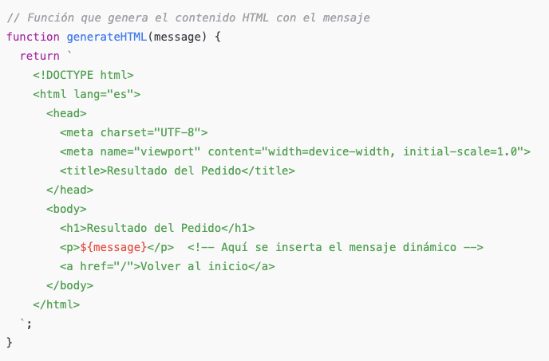

En esta actividad aprenderás cómo crear una API simple en Express que maneja pedidos y devuelve respuestas dinámicas en formato HTML. En lugar de utilizar plantillas o motores de plantillas como EJS, vamos a generar el contenido HTML directamente desde el servidor, insertando mensajes personalizados según el valor del pedido.

**Lógica de negocio**
Vamos a repasar paso a paso las reglas que hemos definido para la validación del pedido:

- **El valor del pedido debe ser mayor que 100:**

Si un cliente realiza un pedido con un valor menor o igual a 100, el sistema lo considera inválido.
Regla de negocio: Un pedido no se procesa si el valor es demasiado bajo, ya que tal vez la empresa no quiera gestionar pedidos pequeños por cuestiones operativas o económicas.
Mensaje asociado: "El valor del pedido debe ser mayor a 100 para ser procesado."

- **El valor máximo del pedido es 500:**

Si el valor del pedido es mayor a 500, el sistema lo rechaza, ya que el valor excede el límite máximo establecido por la empresa para un pedido.
Regla de negocio: Establecer un límite máximo para evitar que el sistema reciba pedidos de un valor demasiado alto, tal vez debido a restricciones de inventario, capacidad de entrega, o políticas comerciales.
Mensaje asociado: "El valor máximo del pedido es 500."

- **Pedidos válidos entre 101 y 500:**

Si el valor del pedido está dentro del rango de 101 a 500, el pedido es aceptado y procesado.
Regla de negocio: Si un pedido tiene un valor adecuado (ni demasiado bajo ni demasiado alto), el sistema lo procesa normalmente.
Mensaje asociado: "Pedido realizado con éxito! El valor del pedido es: $<valor>"

```javascript
// Para devolver el resultado, aprovechamos de una funcion generateHTML que creamos nosotros
return res.status(400).send(generateHTML('El valor máximo del pedido es 500.'));
```


Nuestra funcion para generar una respuesta dinámica: generateHTML:




**Respuesta con EJS**

```javascript
res.status(200).render('orderResult', { message: `Pedido realizado con éxito! El valor del pedido es: $${orderValue}` });
```

```html
 <p><%= message %></p> <!-- The message will be dynamically inserted here -->
```