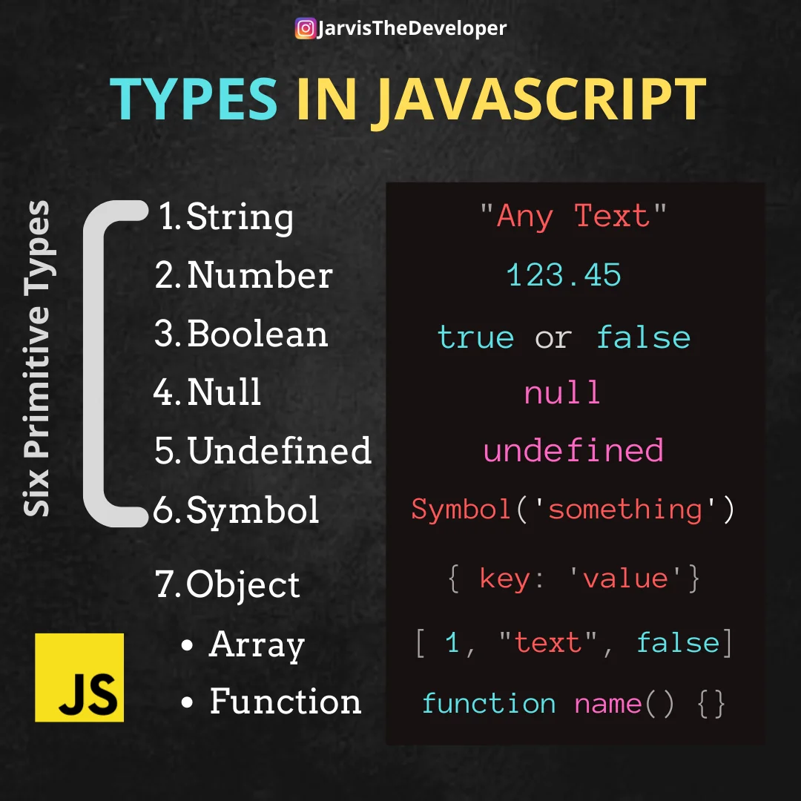
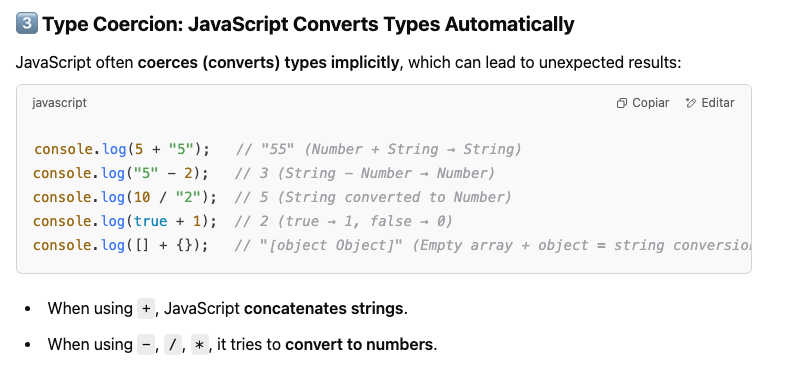

# Fundamentos de JavaScript

## Scripting

### Módulos principales

JavaScript es un tema muy amplio, con muchas características, estilos y técnicas diferentes para aprender, y muchas APIs y herramientas construidas sobre él. Este módulo se centra principalmente en los aspectos esenciales del lenguaje central, además de algunos temas clave relacionados. Aprender estos temas te proporcionará una base sólida para trabajar.

## 1 Variables

### Resultados de aprendizaje:

- Entender qué son las variables y por qué son tan importantes en la programación en general, no solo en JavaScript.
- Declarar variables con `let` e inicializarlas con valores.
- Reasignar variables con nuevos valores.
- Crear constantes con `const`.
- La diferencia entre variables y constantes, y cuándo usar cada una.
- Entender las mejores prácticas para nombrar variables. Si no se menciona explícitamente, todos los ejemplos deben mostrar buenas prácticas de nombrado de variables en acción.
- Los diferentes tipos de valores que pueden almacenarse en variables: cadenas de texto, números, booleanos, arreglos y objetos.
- tipos primitivos (inmutables) (por valor)
- tipos objetos (mutables) (por referencia)

### Conversión de tipos de datos

## 2 Matemáticas

### Resultados de aprendizaje:

- Operaciones básicas con números en JavaScript: sumar, restar, multiplicar y dividir.
- Entender que los números no son números si se definen como cadenas de texto, y cómo esto puede causar errores en los cálculos.
- Convertir cadenas a números con `Number()`.
- Precedencia de los operadores.
- Incrementar y decrementar.
- Operadores de asignación, por ejemplo, asignación de suma y asignación de resta.
- Operadores de comparación.
- Métodos básicos del objeto Math, como `Math.random()`, `Math.floor()` y `Math.ceil()`.

## 3 Texto

### Resultados de aprendizaje:

- Crear literales de cadenas de texto.
- Entender la necesidad de usar comillas coincidentes.
- Concatenación de cadenas de texto.
- Escapar caracteres en cadenas de texto.
- Literales de plantillas:
    - Usar variables en literales de plantillas.
    - Literales de plantillas multilínea.
- Manipulación de cadenas de texto usando propiedades y métodos comunes como:
    - `length`
    - `toString()`
    - `includes()`
    - `indexOf()`
    - `slice()`
    - `toLowerCase()` y `toUpperCase()`
    - `replace()`

## 4 Arreglos

### Resultados de aprendizaje:

- Entender qué es un arreglo: una estructura que contiene una lista de variables.
- La sintaxis de los arreglos: `[a, b, c]` y la sintaxis de acceso, `myArray[x]`.
- Modificar los valores de los arreglos con `myArray[x] = y`.
- Manipulación de arreglos utilizando propiedades y métodos comunes como:
    - `length`
    - `indexOf()`
    - `push()` y `pop()`
    - `shift()` y `unshift()`
    - `join()` y `split()`
    - Métodos avanzados como `forEach()`, `map()` y `filter()`.

## 5 Condicionales

### Resultados de aprendizaje:

- Entender qué es una estructura condicional: una estructura de código para ejecutar diferentes caminos de código dependiendo del resultado de una prueba.
- `if ... else ... else if`.
- Usar operadores de comparación para crear pruebas.
- Operadores lógicos AND, OR y NOT en pruebas.
- Sentencias `switch`.
- Operadores ternarios.

## 6 Bucles

### Resultados de aprendizaje:

- Entender el propósito de los bucles: una estructura de código que permite hacer algo muy similar muchas veces sin repetir el mismo código para cada iteración.
- Bucles básicos `for`.
- Iterar sobre colecciones con `for ... of`.

#### Notas:

- Existen muchos otros tipos de bucles en JavaScript que no se listan aquí. No es necesario (ni útil) entender todos ellos en esta etapa. Por ahora, los estudiantes necesitan entender el propósito de los bucles y los tipos más comunes.
- Uso de `break` y `continue`.

## 7 Funciones

### Resultados de aprendizaje:

- Entender el propósito de las funciones: permitir la creación de bloques de código reutilizables que se pueden llamar cuando sea necesario.
- Entender que las funciones se usan en todo JavaScript, algunas son integradas en el navegador y otras definidas por el usuario.
- Comprender la diferencia entre funciones y métodos.
- Invocar una función.
- Valores de retorno.
- Comprender el ámbito global y el ámbito de funciones/bloques.
- Pasar argumentos a las llamadas de función.
- Funciones nombradas y anónimas.
- Construir funciones personalizadas:
    - Incluir parámetros.
    - Incluir valores de retorno.
- Funciones de retorno (callback functions): entender que los argumentos de las funciones pueden ser también funciones, y qué patrón es este.
- Funciones flecha (arrow functions).

## 8 Conceptos básicos de objetos en JavaScript

### Resultados de aprendizaje:

- Entender que en JavaScript la mayoría de las cosas son objetos, y probablemente has utilizado objetos cada vez que has tocado JavaScript.
- Sintaxis básica:
    - Literales de objetos.
    - Propiedades y métodos.
    - Anidación de objetos y arreglos en objetos.
    - Usar constructores para crear un objeto nuevo.
    - Ámbito de objetos y `this`.
- Acceder a propiedades y métodos — sintaxis de corchetes y de punto.
- Desestructuración de objetos.

## 9 Scripting del DOM

### Resultados de aprendizaje:

- Entender qué es el DOM: la representación interna del navegador de la estructura HTML del documento como una jerarquía de objetos, que se puede manipular usando JavaScript.
- Entender las partes importantes de un navegador web y cómo están representadas en JavaScript: `Navigator`, `Window` y `Document`.
- Entender cómo los nodos del DOM existen de manera relativa entre ellos en el árbol del DOM: raíz, padre, hijo, hermano y descendiente.
- Obtener referencias a los nodos del DOM, por ejemplo, con `querySelector()` y `getElementById()`.
- Crear nuevos nodos, por ejemplo, con `innerHTML()` y `createElement()`.
- Agregar y quitar nodos al DOM con `appendChild()` y `removeChild()`.
- Agregar atributos con `setAttribute()`.
- Manipular estilos con `Element.style.*` y `Element.classList.*`.

## 10 Eventos

### Resultados de aprendizaje:

- Entender qué son los eventos: una señal emitida por el navegador cuando ocurre algo significativo, a lo cual el desarrollador puede responder con algún código.
- Controladores de eventos:
    - `addEventListener()` y `removeEventListener()`
    - Propiedades del controlador de eventos.
    - Atributos de manejadores de eventos en línea y por qué no deberías usarlos.
    - Objetos de eventos.
    - Prevenir comportamientos por defecto con `preventDefault()`.
    - Delegación de eventos.

## 11 Conceptos básicos de JavaScript asincrónico

### Resultados de aprendizaje:

- Entender el concepto de JavaScript asincrónico — qué es y cómo se diferencia del JavaScript síncrono.
- Comprender que los callbacks y eventos han sido históricamente los medios para hacer programación asincrónica en JavaScript.
- Programación asincrónica moderna con funciones `async` y `await`:
    - Uso básico.
    - Entender los valores de retorno de las funciones `async`.
    - Manejo de errores con `try ... catch`.
- Promesas:
    - Comprender que `async/await` usa promesas bajo el capó; proporcionan una abstracción más sencilla.
    - Encadenar promesas.
    - Capturar errores con `catch()`.

## 12 Peticiones de red con `fetch()`

### Resultados de aprendizaje:

- Entender que `fetch()` se usa para realizar peticiones asincrónicas a la red, que es el caso de uso más común de JavaScript asincrónico en la web.
- Hacer una solicitud GET con `fetch()`.
- Recibir y manejar las respuestas de la solicitud, incluidas las respuestas de error.
- Usar `then()` y `catch()` para manejar promesas devueltas por `fetch()`.
- Hacer una solicitud POST con `fetch()` y enviar datos en el cuerpo de la solicitud.

# Recursos
https://developer.mozilla.org/en-US/curriculum/core/javascript-fundamentals/

