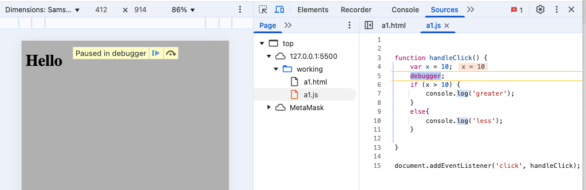

# Debugger (comando debugger)

La palabra clave debugger en JavaScript se utiliza para activar el depurador (debugger) en el código, lo que permite hacer una pausa en la ejecución del programa y examinar el estado del programa en ese momento. Es una herramienta útil para depurar y analizar el flujo de ejecución del código.



## ¿Cómo funciona?
Cuando se encuentra la palabra clave debugger en el código, la ejecución del script se detiene (si el depurador del navegador o del entorno está activo). Esto permite inspeccionar las variables, el estado de la aplicación, y el flujo de ejecución en ese momento. Una vez que se detiene en el punto donde se encuentra el debugger, puedes usar las herramientas de desarrollo del navegador (por ejemplo, las DevTools de Chrome) para examinar el código.

Sintaxis básica:
```javascript
debugger;
```
Cuando el código se ejecuta y se encuentra con esta línea, la ejecución se detendrá si tienes el depurador habilitado en las herramientas de desarrollo del navegador.

Ejemplo de uso:
```javascript
function suma(a, b) {
    debugger; // Pausa la ejecución aquí
    return a + b;
}

let resultado = suma(5, 3);
console.log(resultado);
```

## Pasos para usar debugger:
Activar las Herramientas de Desarrollo:

En la mayoría de los navegadores, puedes abrir las herramientas de desarrollo presionando F12 o Ctrl+Shift+I (en Chrome y otros navegadores basados en Chromium).
Colocar el debugger en el código donde quieras hacer la pausa. En el ejemplo anterior, se coloca dentro de la función suma.

Ejecutar el código: Cuando el código llega a la palabra clave debugger, la ejecución se detiene y el depurador entra en modo de pausa.

Inspeccionar las variables y el estado:

Puedes ver las variables locales, el contexto de ejecución, y realizar pasos a través del código usando las herramientas de depuración.
Las herramientas de desarrollo proporcionan botones para continuar la ejecución, avanzar línea por línea, o inspeccionar los valores de las variables.

## ¿Cuándo usar debugger?
- Para depurar problemas: Si tu código no se comporta como esperas y quieres ver el estado del programa en un punto específico, puedes insertar un debugger para hacer una pausa y revisar las variables.
- Explorar el flujo de ejecución: Si tienes una función compleja o un flujo de código con condiciones, debugger te permitirá inspeccionar la secuencia de ejecución.
Desventajas del uso de debugger:
- No debe ser dejado en producción: No se recomienda dejar instrucciones debugger en el código de producción, ya que detendrán la ejecución del script para los usuarios finales si tienen las herramientas de desarrollo habilitadas.
- Debe ser usado con precaución: El uso excesivo de debugger puede hacer que el código se vuelva difícil de mantener. Es mejor usarlo temporalmente mientras depuras y eliminarlo antes de la entrega.

## Alternativa:
Si no quieres usar la palabra clave debugger, también puedes utilizar console.log() para imprimir valores y seguir el flujo del código.

```javascript
function suma(a, b) {
    console.log('a:', a, 'b:', b); // Muestra el valor de a y b
    return a + b;
}

let resultado = suma(5, 3);
console.log('Resultado:', resultado);
```

## Resumen:
debugger es una herramienta poderosa para depurar código JavaScript.
Hace una pausa en la ejecución del código en el punto donde se coloca.
Puedes inspeccionar el estado del programa, ver valores de variables y controlar el flujo de ejecución.
Úsalo solo durante el proceso de desarrollo y depuración, y elimínalo antes de la producción.


