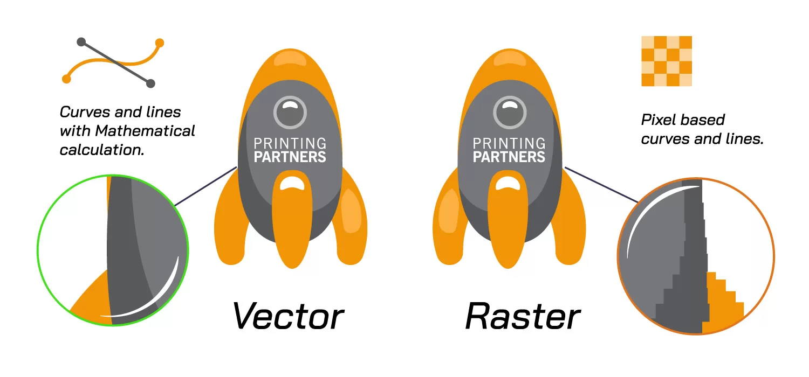

# Imagenes raster



Una imagen raster (o bitmap) es un tipo de imagen digital que está compuesta por una matriz de píxeles o puntos de color. Cada píxel tiene un valor de color específico, y juntos forman la imagen completa. Las imágenes raster se usan comúnmente en fotografía digital, ilustraciones, y otros tipos de gráficos detallados.

Escalabilidad: Las imágenes raster no se escalan bien. Si intentas aumentar su tamaño más allá de su resolución original, perderán calidad y se verán pixeladas (es decir, los píxeles serán visibles).

**La resolución de una imagen raster depende directamente de la cantidad de píxeles que la componen. Cuantos más píxeles haya en una imagen, mayor será su resolución, y por ende, mejor será la calidad de los detalles.**

Si intentas ampliar una imagen con baja resolución, verás que se "pixeliza", es decir, los píxeles individuales serán visibles y la imagen perderá nitidez.

Tipos de archivo comunes: Algunos de los formatos más comunes para imágenes raster son:

- JPEG (.jpg)
- PNG (.png)
- GIF (.gif)
- BMP (.bmp)
- TIFF (.tiff)
- WebP (.webp)

**PPI (Píxeles por Pulgada)** es una unidad de medida que indica la densidad de píxeles en una imagen o pantalla. Es una forma de medir cuántos píxeles caben en una pulgada lineal de espacio en una pantalla o en una imagen impresa.


# Vectoriales
A diferencia de las imágenes vectoriales, que están basadas en fórmulas matemáticas para crear formas, las imágenes raster dependen de píxeles. Las imágenes vectoriales se pueden escalar sin pérdida de calidad, mientras que las imágenes raster pierden calidad al cambiar su tamaño.

## Demo

```svg
<svg viewBox="0 0 100 100" style={{border: '2px solid black'}} >
    <rect height="10" width="10" fill="blue"/>
    <circle cx="50" cy="50" r="10" />
    <polygon />
    <line />
    <path d="M54 20 L20 23 Z" fill="blue"/>
</svg>
```

## Actividad - Crear un svg


## Recursos
https://www.svgator.com/blog/what-is-svg-interactivity/#2-svg-interactivity-triggered-on-hover-mouse-over