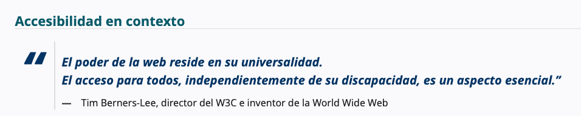
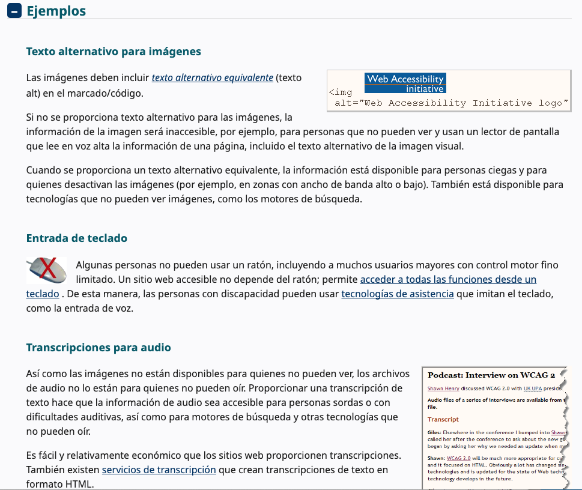

# Accesibilidad

[Definición](https://www.w3.org/WAI/)

## Accesibilidad en contexto

La Web está diseñada fundamentalmente para funcionar para todas las personas, independientemente de su hardware, software, idioma, ubicación o capacidad. Cuando la Web cumple este objetivo, es accesible para personas con diversas capacidades auditivas, motoras, visuales y cognitivas.

Por lo tanto, el impacto de la discapacidad en la web cambia radicalmente, ya que esta elimina las barreras de comunicación e interacción que muchas personas enfrentan en el mundo físico. Sin embargo, cuando los sitios web, las aplicaciones, las tecnologías o las herramientas están mal diseñados, pueden crear barreras que impiden el uso de la web.

La accesibilidad es esencial para los desarrolladores y las organizaciones que desean crear sitios web y herramientas web de alta calidad y no excluir a las personas del uso de sus productos y servicios.

¿Qué es la accesibilidad web?
Accesibilidad web significa que los sitios web, las herramientas y las tecnologías están diseñados y desarrollados para que las personas con discapacidad puedan usarlos. Más específicamente, las personas pueden:

- Percibir, comprender, navegar e interactuar con la Web
- contribuir a la Web

La accesibilidad web abarca todas las discapacidades que afectan el acceso a la Web, incluidas:

- auditivo
- cognitivo
- neurológico
- físico
- discurso
- visual

La accesibilidad web también beneficia a las personas sin discapacidad, por ejemplo:

- Personas que utilizan teléfonos móviles, relojes inteligentes, televisores inteligentes y otros dispositivos con pantallas pequeñas, diferentes modos de entrada, etc.
- Personas mayores con capacidades cambiantes debido al envejecimiento.
personas con “discapacidades temporales”, como un brazo roto o la pérdida de gafas
- Personas con “limitaciones situacionales”, como por ejemplo, en condiciones de luz solar intensa o en un entorno donde no pueden escuchar audio.
- Personas que utilizan una conexión a Internet lenta o que tienen un ancho de banda limitado o costoso.

## ¿Qué hacer para que tu web sea accesible?

- [Principios](https://www.w3.org/WAI/fundamentals/accessibility-principles/) 
- [Easy checks](https://www.w3.org/WAI/test-evaluate/easy-checks/)
- [Tips, Pistas](https://www.w3.org/WAI/tips/)

## Actividades
### Actividad 1 - Verificación facíl
Usando una página web tuyo (proyecto), pasar por el guia e implementar las sugerencias:

https://www.w3.org/WAI/test-evaluate/easy-checks/

### Actividad 2 - WCAG Guia
(https://www.w3.org/WAI/WCAG22/quickref/?versions=2.1)

## Actividad 3 - Markup validation service
https://validator.w3.org/

## Referencias
[Guia de Mozilla](https://developer.mozilla.org/es/docs/Web/Accessibility)

[Accesibilidad Cheat Sheets](https://moritzglantz.de/accessibility-cheatsheet/)

[Accesibilidad Cheat Sheets](https://learntheweb.courses/topics/accessibility-cheat-sheet/)

[Ejemplos](https://www.dbswebsite.com/blog/ada-compliance-starts-with-accessible-design/)