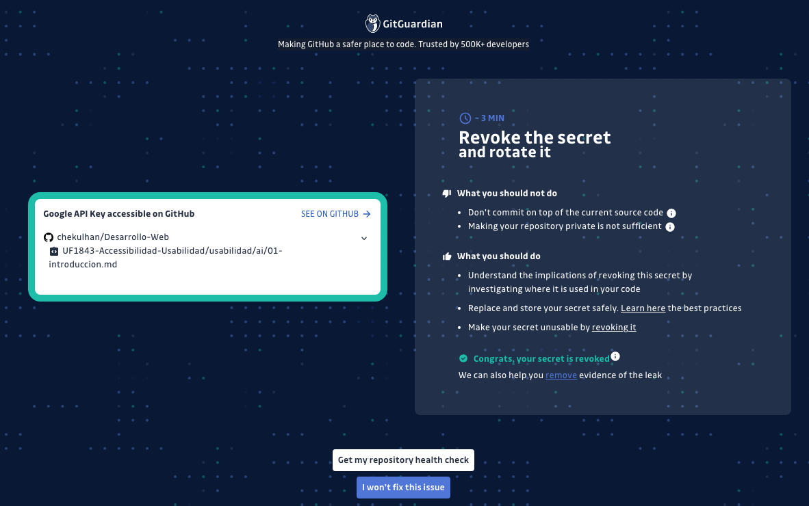

# API KEYS

En React, las API keys no deben incluirse directamente en el código fuente, ya que cualquier código que se ejecute en el navegador será accesible para los usuarios. Para proteger estas claves, React utiliza variables de entorno, las cuales se almacenan en un archivo .env.

## Uso de las API Keys en React:
Archivo .env:

Crea un archivo llamado .env en la raíz de tu proyecto React.
Dentro del archivo, almacena las claves de las API utilizando el prefijo REACT_APP_ para que React pueda acceder a ellas.
Ejemplo:

```env
REACT_APP_API_KEY=tu_clave_de_api_aqui
REACT_APP_API_URL=https://api.ejemplo.com
```

## Acceso a las Variables en React:

Dentro de tu código React, puedes acceder a estas variables de entorno usando process.env.REACT_APP_.
Ejemplo en un componente:

```javascript
const apiKey = process.env.REACT_APP_API_KEY;
const apiUrl = process.env.REACT_APP_API_URL;

console.log(apiKey);  // Mostrará la clave en la consola
```

## No Subir a GitHub:

Nunca subas el archivo .env a GitHub o a un repositorio público, ya que contiene información sensible como las claves de API. Puedes agregar el archivo .env a tu archivo .gitignore para evitar que se suba.
Ejemplo de .gitignore:

```bash
.env
```




## Consideraciones de Seguridad:

Si bien las claves almacenadas en el .env archivo se procesan y se pueden usar en el código React, estas claves siguen estando expuestas en el navegador cuando se construye la aplicación, por lo que no debes incluir información sensible (como claves privadas) en las aplicaciones cliente. Si es posible, es mejor crear un servidor backend para manejar las claves de API de manera segura.

## Resumen:
- Usa un archivo .env para almacenar tus claves de API.
- Asegúrate de que las claves empiecen con REACT_APP_ para ser accesibles en el código.
- No subas el archivo .env a GitHub (agrega .env a .gitignore).
- Aunque las claves de API se pueden incluir en el código cliente de React, se recomienda mantenerlas seguras usando un backend si es posible.