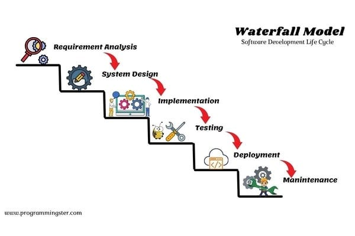

# Modelo Waterfall (Cascada)

El **modelo Waterfall**, también conocido como el **modelo en cascada**, es una de las metodologías de desarrollo de software más antiguas. Se originó en los años 70 y se basa en un enfoque secuencial y estructurado en el que cada fase del proyecto se completa antes de pasar a la siguiente.

https://www.youtube.com/watch?v=Vqn0a4MJhXM

## Características del modelo Waterfall

1. **Enfoque secuencial**: Las fases del desarrollo siguen un orden lineal y no se retrocede a una fase anterior. El proceso se realiza en etapas bien definidas, como si fuera una cascada.

2. **Fases principales**:
   - **Requisitos**: Se recopilan y documentan todos los requisitos del sistema.
   - **Diseño**: Se realiza el diseño del sistema con base en los requisitos.
   - **Implementación**: El sistema es construido y codificado.
   - **Verificación**: Se realiza la prueba del sistema para asegurarse de que cumple con los requisitos.
   - **Mantenimiento**: Se da soporte y se realizan cambios después de que el sistema esté en producción.

3. **Documentación extensiva**: Cada fase requiere una documentación detallada que se entrega antes de pasar a la siguiente fase.

## Fechas importantes (hitos)

- **1970** – **Winston W. Royce** describe el modelo Waterfall en su artículo *“Managing the Development of Large Software Systems”*. Aunque Royce no proponía estrictamente el modelo como tal, su descripción se convirtió en la base de lo que sería el modelo Waterfall.
- **1980-1990** – El modelo Waterfall se establece como una de las metodologías más utilizadas para el desarrollo de software en la industria.

## Desventajas del modelo Waterfall

1. **Rigidez**: No permite cambios fáciles durante el proceso de desarrollo. Una vez que se pasa de una fase a la siguiente, es difícil volver atrás sin generar grandes costos.
   
2. **No flexible**: El modelo no es adecuado para proyectos donde los requisitos pueden cambiar o evolucionar durante el desarrollo.

3. **Alto riesgo y coste**: La mayoría de las pruebas se realizan solo al final del proyecto, lo que puede resultar en la detección tardía de errores costosos.

4. **Falta de retroalimentación temprana**: Como no se realizan pruebas hasta las etapas finales, la retroalimentación de los usuarios se obtiene demasiado tarde, lo que puede causar problemas en la calidad del producto.

5. **Difícil manejo en proyectos grandes**: El enfoque secuencial es difícil de manejar en proyectos grandes y complejos debido a la falta de flexibilidad y adaptación.
