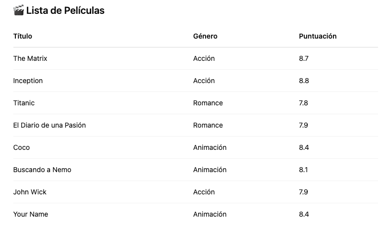

# Movimiento Agile

## Desarrollo Rápido de Aplicaciones (RAD)

El Desarrollo Rápido de Aplicaciones (RAD) surgió en la década de 1980 como respuesta a las metodologías de desarrollo de software lentas y rígidas de la época, especialmente el modelo Waterfall (Cascada).

El término fue popularizado por James Martin en su libro de 1991 *Rapid Application Development*, pero las ideas fundamentales ya estaban en práctica en la década de 1980, con enfoques de desarrollo iterativo utilizados en empresas como IBM y otras.

**Hitos clave**:
Década de 1980 – IBM y otras compañías experimentan con enfoques iterativos y de prototipos.

1991 – James Martin formaliza RAD en su libro.

Década de 1990 – RAD se convierte en una metodología ampliamente utilizada, influenciando a Agile y otros enfoques modernos.

**Características de RAD:**
El enfoque RAD se centra en la creación de prototipos, la retroalimentación continua de los usuarios y el desarrollo iterativo, lo que lo convierte en un precursor temprano de metodologías como Agile y marcos de trabajo como Scrum.

## Extrame Programming
http://www.extremeprogramming.org/

### Actividad - Peer programming

Vas a trabajar con un conjunto de películas, cada una con su título, género y puntuación. El objetivo es crear un programa que pregunte al usuario por un género y le recomiende las 2 películas mejor puntuadas dentro de ese género.

Roles:
- 👨‍💻 Driver: escribe el código y explica en voz alta lo que hace.
- 🧠 Navigator: revisa el código en tiempo real, propone ideas y detecta errores o mejoras.

**Ejemplo de interacción con el usuario:**
Ingresa un género (por ejemplo: Acción, Romance, Animación): Animación

🎬 Top 2 películas de Animación:

Coco (Puntuación: 8.4)
Your Name (Puntuación: 8.4)




Comandos: list comprehension, lambda (funciones anónimas)

---

# Respuestas
```python
def cargar_peliculas():
    return [
        {"title": "The Matrix", "genre": "Acción", "rating": 8.7},
        {"title": "Inception", "genre": "Acción", "rating": 8.8},
        {"title": "Titanic", "genre": "Romance", "rating": 7.8},
        {"title": "El Diario de una Pasión", "genre": "Romance", "rating": 7.9},
        {"title": "Coco", "genre": "Animación", "rating": 8.4},
        {"title": "Buscando a Nemo", "genre": "Animación", "rating": 8.1},
        {"title": "John Wick", "genre": "Acción", "rating": 7.9},
        {"title": "Your Name", "genre": "Animación", "rating": 8.4},
    ]

def recomendar_peliculas(peliculas, genero, cantidad=3):
    filtradas = [p for p in peliculas if p['genre'].lower() == genero.lower()]
    if not filtradas:
        print(f"No se encontraron películas del género: {genero}")
        return
    ordenadas = sorted(filtradas, key=lambda x: x['rating'], reverse=True)
    print(f"\n🎬 Top {cantidad} películas de {genero.title()}:\n")
    for p in ordenadas[:cantidad]:
        print(f"{p['title']} (Puntuación: {p['rating']})")

def main():
    peliculas = cargar_peliculas()
    genero = input("Ingresa un género (por ejemplo: Acción, Romance, Animación): ")
    recomendar_peliculas(peliculas, genero)

if __name__ == "__main__":
    main()
```

**List Comprehension**
3 parts: [devolver for condicion]

```python
nombres = ["Ana", "Juan", "Pedro", "Laura", "Luisa"]
largos = [nombre for nombre in nombres if len(nombre) > 4]
```
**Lambda demo:**
Las lambda son muy útiles cuando necesitas una función corta que solo se usa una vez, por ejemplo al ordenar, filtrar, o mapear elementos en una lista.

```python
doble = lambda x: x * 2
print(doble(5))  # Resultado: 10

sumar = lambda a, b: a + b
print(sumar(3, 4))  # Resultado: 7

```
