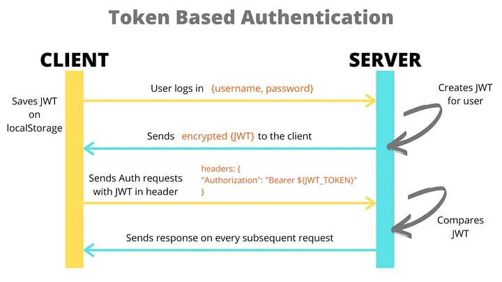

# Calidad de software

https://iso25000.com/index.php/normas-iso-25000/iso-25010

| Característica ISO       | ¿Cómo se ve en un proyecto Node/React?                                               |
|--------------------------|----------------------------------------------------------------------------------------|
| Funcionalidad            | ¿La API responde correctamente? ¿Cumple lo prometido?                                 |
| Fiabilidad               | ¿Se cae ante errores? ¿Maneja excepciones?                                            |
| Usabilidad               | (En frontend) ¿Es claro y fácil de usar?                                              |
| Eficiencia del rendimiento | ¿Carga rápido? ¿Consume muchos recursos?                                           |
| Mantenibilidad           | ¿El código está ordenado, comentado y dividido?                                       |
| Portabilidad             | ¿Funciona en distintos entornos? ¿En Windows, Mac, Docker?                            |
| Seguridad                | ¿Protege las rutas? ¿Hay validación de datos?                                         |
| Compatibilidad           | ¿La API responde bien a distintos clientes (fetch, axios, postman)?                   |

# Idiomas

Instalar:
```bash
npm install i18next react-i18next
```

Usar solo en el caso de conflictos de Typescript:

```bash
npm uninstall typescript react-scripts fork-ts-checker-webpack-plugin

npm cache clean --force

npm install i18next react-i18next

npm install react-scripts
```


Colocar el config archivo en /utils.
```jsx
// i18n.js (or similar file)
import i18next from 'i18next';
import { initReactI18next } from 'react-i18next';
import enTranslations from './locales/en.json';
import esTranslations from './locales/es.json';

i18next
  .use(initReactI18next) // passes i18n down to react-i18next
  .init({
    resources: {
      en: {
        translation: enTranslations,
      },
      es: {
        translation: esTranslations,
      },
    },
    lng: 'en', // default language
    fallbackLng: 'en', // fallback language in case of missing translations
    interpolation: {
      escapeValue: false, // react already safes from xss
    },
  });
```

En /utiles/locales/, tendrás archivos de diferentes idiomas, como en.json y es.json:
```json
{
    "welcome_message": "Bienvenido a la Aplicación React"
}
```

En index.js o App.js, incluir la referencia a i18n.js para poder usarlo en la aplicación:
```jsx
import './utils/i18n';  // Path is relative to the current file (index.js)
```

Finalmente, para usarlo en un componente:

```jsx
import { useTranslation } from 'react-i18next';

function HomePage = () => {

    const { t, i18n } = useTranslation();

    const changeLanguage = (lang) => {
      i18n.changeLanguage(lang);
    };

    
  return (
    <div>
      <h1>{t('welcome_message')}</h1>
      
      <button onClick={() => changeLanguage('en')}>English</button>
      <button onClick={() => changeLanguage('es')}>Español</button>
    </div>
  );
}
export default HomePage;

```


**Seguridad**
# Base 64 y Hash de contraseñas
/express/07.1-base64.md
/express/07.2-bcrypt.md

## Express Validator
Vamos a usar `express-validator` para ayudarnos en proteger las rutas de nuestra aplicacion de express. Ve la documentación en /express/08-middleware.avanzado.md


## JWT
https://jwt.io/

(profesor: explicar login tradicional)



Vamos a crear un proyecto para la gestión de usuarios. Ve a la documentación en /express/09-autenticacion.jwt.md

