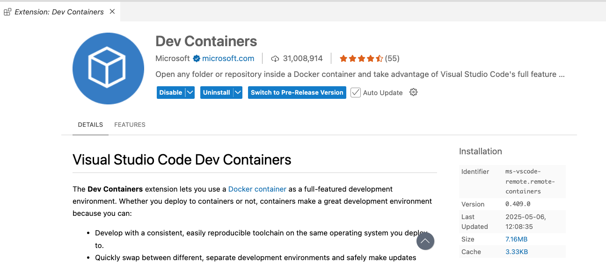

# NPM
npm-check-updates (ncu) es una herramienta que permite detectar y actualizar las dependencias de un proyecto Node.js a sus últimas versiones disponibles, incluso si esas versiones están fuera del rango definido en el archivo package.json.

A diferencia de npm install, que respeta los rangos de versiones ya escritos, ncu te muestra qué hay de nuevo y actualiza esos rangos si lo deseas.

El objetivo principal de npm-check-updates es ayudarte a mantener actualizadas las dependencias de tu proyecto de forma segura y controlada, sin necesidad de hacerlo manualmente.

```bash
npm install npm-check-updates --save-dev
npx npm-check-updates
npx npm-check-updates -u    // Para actualizar el package.json con las versiones más recientes
npm install     // Finalmente, instala las nuevas versiones
```


# Docker
## BusyBox

https://hub.docker.com/_/busybox

```bash
docker run -it busybox sh

docker exec -it <name o id> sh
```

```bash
# Check current directory
pwd

# List files (like `ls`)
ls

# Create a file
echo "Hello from BusyBox" > hello.txt

# View file contents
cat hello.txt

# Create a new directory
mkdir mydir

# Move file into directory
mv hello.txt mydir/

# Delete file
rm mydir/hello.txt

# Delete directory
rmdir mydir

# Sleep (wait for 5 seconds)
sleep 5
```


🔧 File and Directory Management

ls         # List files
cd         # Change directory
cp         # Copy files
mv         # Move or rename files
rm         # Remove files
mkdir      # Make directory
rmdir      # Remove empty directory
pwd        # Print current directory
touch      # Create an empty file

📦 Text Viewing and Editing

cat        # View file contents
more       # View file contents page-by-page
head       # Show first lines of a file
tail       # Show last lines of a file
echo       # Print text
vi         # Minimal text editor (if compiled in)

vi: After pressing Esc, enter one of the following commands (all start with :):

Command	Description

- :w	Save (write) the file
- :q	Quit
- :wq or ZZ	Save and quit
- :q!	Quit without saving (force)

1. Open file: vi myfile.txt
2. Press i to start editing
3. Type your text
4. Press Esc
5. Type :wq then press Enter to save and quit


📂 File Info and Searching

- find       # Search for files
- grep       # Search text in files
- stat       # Show file status/info


## LOLCode
https://hub.docker.com/r/esolang/lolcode

```bash
docker pull esolang/lolcode
docker run -it --name lol esolang/lolcode  sh
```

Usandi vi, crear un programa de "hello.lolcode" y ejecutarlo dentro del contenedor:

```lolcode
HAI 1.2
  CAN HAS STDIO?
  VISIBLE "Hello Lolcode"
KTHXBYE
```

~ # lolcode hello.lolcode

¿Qué hace este programa?
```lolcode
HAI 1.2
  I HAS A NAME
  VISIBLE "What is your name?"
  GIMMEH NAME
  VISIBLE "Hello, " NAME "!"
KTHXBYE
```

Modificar este programa para sumar dos numeros: 

```lolcode
HAI 1.2
  I HAS A NUM
  I HAS A RESULT
  VISIBLE "Please enter a number:"
  GIMMEH NUM
  RESULT R 10 * NUM
  VISIBLE "Your number multiplied by 10 is: " RESULT
KTHXBYE
```

## Nodejs

https://www.youtube.com/watch?v=AquOM-ISsnA&list=PLQhxXeq1oc2n7YnjRhq7qVMzZWtDY7Zz0&index=1

https://docs.docker.com/get-started/docker_cheatsheet.pdf

```bash
docker pull node:alpine

docker images
docker inspect node:alpine

docker run -it node:alpine sh

docker ps
docker ps -a

docker stop <container_id_or_name>
docker rm <container_id_or_name>

```

Ejecutar un contenedor de nuevo:
```bash
docker run -it --name nodejs node:alpine sh     // crear el contenedor con un nombre

docker ps
docker start <container_id_or_name>
docker exec -it <container_id_or_name> sh

```


# Configurar una aplicacion web con express en el contenedor

```bash
docker run -it -p 3000:3000 --name nodejs node:alpine sh
docker cp app.js nodejs:/home/node/app/app.js

docker start nodejs
docker exec -it nodejs sh


mkdir home/node/app - go to node dir and add a app folder
npm init -y
npm install express

```

/home/node/app # node app.js

Ahora acceder a  http://localhost:3000/ desde tu ordenador.


```js
// Import the express module
const express = require('express');

// Create an Express application
const app = express();

// Define a route for the homepage
app.get('/', (req, res) => {
  res.send('Hello, World!'); // Send the "Hello, World!" message as a response
});

// Set the app to listen on port 3000
app.listen(3000, () => {
  console.log('Server is running on http://localhost:3000');
});
```


# Build una aplicacion de express

Crear una aplicacion básica de express llamado *my-express-app* disponible el puerto 3001.

Confirmar antes que todo funciona ejecutando un *npm start*.
```json
{
  "name": "my-express-app",
  "version": "1.0.0",
  "description": "",
  "main": "index.js",
  "type": "module",
  "scripts": {
    "start": "node index.js"  
  },
  "keywords": [],
  "author": "",
  "license": "ISC",
  "dependencies": {
    "express": "^5.1.0"
  }
}

```

index.js
```js
// Import the Express library
import express from "express";

// Create an Express app
const app = express();

// Define a route for the root path
app.get('/', (req, res) => {
  res.send('Hello, World!');
});

// Start the server on port 3001
app.listen(3001, () => {
  console.log('Server is running on http://localhost:3001');
});

```

Colocar .dockerignore y Dockerfile en el mismo directorio.

```bash
docker build -t my-express-app .

docker run -d -p 3001:3001 --name my-express-app my-express-app
```


## Python

```bash
docker pull python:3.11-slim

docker run -it python /bin/bash

docker start <container_name>
docker exec -it  <container_id_or_name> /bin/bash
```

Vamos a configurar un entorno de desarrollo con la extension "Dev Containers":




### Actividad 

Aqui tienes el psuedocode para un programa de Python para gestionar tu playlist de canciones, usando comandos de la consola como input(), print().


```
Mostrar mensaje de bienvenida

Crear una lista vacía llamada "playlist"

Mientras sea verdadero:
    Pedir al usuario que ingrese el nombre de una canción
    Pedir al usuario el nombre del artista
    
    Si el usuario escribe "fin" (ignorando mayúsculas/minúsculas):
        Salir del bucle
    
    
    Crear una cadena con el formato "canción por artista"
    Agregar esa cadena a la lista "playlist"


    Mostrar mensaje de confirmación de que se agregó la canción


Al final, mostrar un mensaje de "Tu Playlist:"
Para cada elemento en la lista "playlist":
    Mostrar el número y el nombre de la canción con el artista

```

Te han dado estos datos en formato csv sobre las canciones y el númoer de reproducciones:
```csv
Canción,Artista,Duración (min),Reproducciones
Sol de Verano,Luz Rivera,3.5,120
Noches en Vela,Juan Torres,4.1,98
Bajo la Lluvia,Camila Vega,3.8,135
Caminos Cruzados,Los del Sur,4.5,150
Mar Abierto,Elena Márquez,4.0,110
Susurros,Andrés Luna,3.2,143
Hasta el Alba,Sofía Méndez,3.9,160
Vuelo Libre,Grupo Horizonte,4.3,100
Ecos del Tiempo,Raúl Martínez,5.0,90
Latidos,Clara Solís,3.7,155
```

Tareas:
1. Cargar los datos desde el CSV usando un DataFrame (como en Pandas)
2. Ordenar por número de reproducciones
3. Mostrar las 5 canciones más reproducidas.

