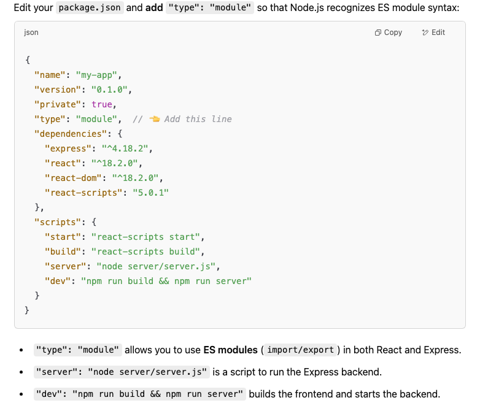

# Opciones de instalacion y configuracion con ReactJS
1️⃣ Express en un Servidor Local Separado (Backend y Frontend en Distintos Puertos)
En esta configuración, React y Express se ejecutan en servidores separados y se comunican mediante fetch o Axios.

React (Frontend) corre en localhost:3000.

Express (Backend) corre en otro puerto, como localhost:5000.

React obtiene los datos desde Express mediante llamadas API (fetch o Axios).

🔹 Ventajas:
✅ Facilita la escalabilidad y la implementación independiente del frontend y backend.
✅ Es más realista para aplicaciones en producción.
✅ Permite alojar el frontend y el backend en servidores distintos si es necesario.

🔹 Desventajas:
❌ Requiere configurar CORS para permitir la comunicación entre dominios.
❌ Se necesitan dos comandos separados para ejecutar React y Express.

2️⃣ Express y React en el Mismo Servidor (Mismo Localhost y Puerto)
En este enfoque, React y Express están integrados en un solo proyecto y comparten el mismo puerto.

Express actúa como backend y también sirve los archivos estáticos del frontend.

React se compila (npm run build) y Express lo sirve desde la carpeta build.

No es necesario configurar CORS, ya que todo se ejecuta en el mismo dominio.

🔹 Ventajas:
✅ Simplifica la implementación, ya que solo se ejecuta un servidor.
✅ No requiere configuración adicional de CORS.
✅ Se puede desplegar en una plataforma como Vercel, Heroku o Render fácilmente.

🔹 Desventajas:
❌ Menos flexible si el proyecto crece y necesita escalar los servicios por separado.
❌ El frontend debe compilarse (npm run build) antes de servirse en Express.


**Paso 1:** Crear un proyecto de ReactJS 

Desde, VS Code terminal, crear un nuevo proyecto de ReactJS

```bash
npx create-react-app mi-react-express
```


Abrir VS Code con este proyecto *mi-react-express*

**Paso 2:** Express Module

Instalar el modulo *express* y nodemon para ayudar en el desarrollo:

```bash
npm install express
npm install --save-dev nodemon
```

**OPCION 1:**
```json
"type": "module",
"scripts": {
    "start": "node server/server.js",
    "dev": "nodemon server/server.js" 
  },
```

**OPCION 2**
```json
"type": "module",
"scripts": {
    "start": "react-scripts start",
    "build": "react-scripts build",
    "server": "node server/server.js",
    "dev": "npm run build && npm run server"
  },
```

**OPCION 3:**
Instalamos express en puerto 5000, y ReactJS en su puerto 3000 (por defecto)

Ejecutar Express usando nodemon para automátic restarts en el servidor

```bash
npm install concurrently --save-dev
npm install nodemon --save-dev
npm install cors
```

```json
"scripts": {
  "start": "node server/server.js",
  "client": "react-scripts start",
  "server": "nodemon server/server.js", 
  "dev": "concurrently \"npm run server\" \"npm run client\""
},
```



**Paso 4:**
Crear un server/server.js y copiar el código de Express:

```javascript
import express from "express";
import path from "path";
import cors from 'cors';
import { fileURLToPath } from "url";

const __filename = fileURLToPath(import.meta.url);
const __dirname = path.dirname(__filename);

const app = express();
const PORT = process.env.PORT || 5000;

// Middleware
app.use(cors());
app.use(express.json());

// API Route Example
app.get("/api/message", (req, res) => {
  res.json({ message: "Hello from Express!" });
});

// **OPCIONAL**
// Serve React Frontend 
app.use(express.static(path.join(__dirname, "../build")));

app.get("*", (req, res) => {
  res.sendFile(path.join(__dirname, "../build", "index.html"));
});
// **END OPCIONAL**

// Start Server
app.listen(PORT, () => {
  console.log(`Server running on http://localhost:${PORT}`);
});

```


**Paso 5:** Ejecutar el proyecto
Para ejecutar el proyecto de ReactJS solamente. ReactJS tiene la capacidad por defecto a usar ESModules (Create React App (CRA) is already set up to support ESModules by default, including both import/export syntax and modern JavaScript features) 

```bash
npm start
```

Para ejecutar el proyecto de Express:

```bash
npm run dev
```


**Alternativas**
Si has seleccionado la opcion 3 para tu configuracion, puede seguir estos pasos:

Para ejecutar el proyecto de Express solamente:

```bash
npm run server
```

Para ejecutar tanto el proyecto frontend de React y el proyecto backend de Express:

```bash
npm run dev
```

Para actualizar el proyecto de React, compilarlo:

```bash
npm run build
```
