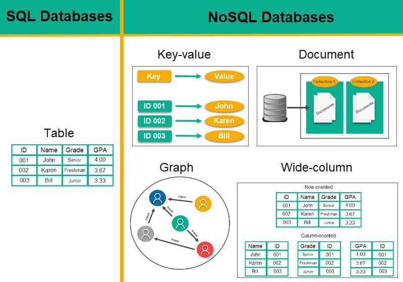
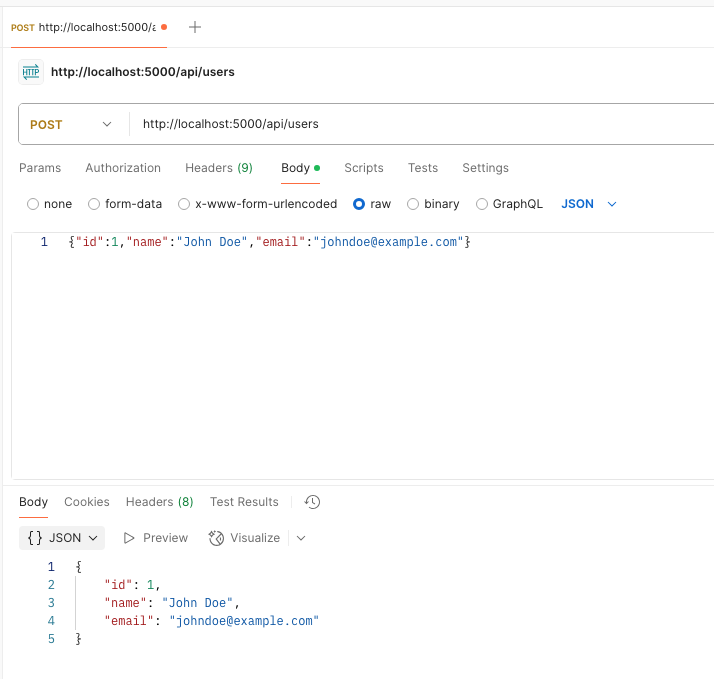
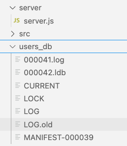

# PouchDB
https://pouchdb.com/



Un documento típico de PouchDB
```json
{
  "_id": "12345",
  "_rev": "1-abc123",
  "name": "John Doe",
  "email": "johndoe@example.com",
  "type": "user"
}
```

# Configuración
```bash
npm install pouchdb
```


Ejecutar el servidor:
```bash
npm run server
```


Crear un route para GET y POST:

```javascript

import PouchDB from 'pouchdb';

// Create a database (if it doesn't already exist)
const db = new PouchDB('users');


app.get('/api/users', async (req, res) => {
  try {
      // Fetch all documents from the 'users_db'
      const result = await db.allDocs({ include_docs: true });
      
      // Extract user data from the documents
      const users = result.rows.map(row => row.doc);

      // Send the users as JSON response
      res.json(users);
  } catch (error) {
      res.status(500).json({ error: 'Failed to retrieve users' });
  }
});

app.post('/api/users', async (req, res) => {
  try {
      const user = req.body; // User data from request body
      
      
      // Insert new user into the database
      const response = await db.post(user);
      
      // Respond with success
      res.status(201).json({ id: response.id, ...user });
  } catch (error) {
      res.status(500).json({ error: 'Failed to add user' });
  }
});
```

# Curl 
curl es una herramienta de línea de comandos que permite hacer peticiones a servidores web. Su nombre proviene de "Client URL" (Cliente URL) y se utiliza para transferir datos hacia o desde un servidor a través de varios protocolos, como HTTP, HTTPS, FTP, entre otros.

```bash

curl -X GET http://localhost:5000/api/users/

curl -X POST http://localhost:5000/api/users \
     -H "Content-Type: application/json" \
     -d '{"name": "John Doe", "email": "johndoe@example.com"}'
```


Usar POSTMAN AGENT para comprobar localhost desarrollo:



**PouchDB**


# NPM
Usando NPM para gestionar la base de datos
```javascript

import PouchDB from 'pouchdb';

// Create a database (if it doesn't already exist)
const db = new PouchDB('mydatabase');

// Add user document
const addUser = async () => {
  const user = {
    _id: 'user_1',  // Unique ID
    name: 'John Doe',
    email: 'johndoe@example.com',
  };
  try {
    await db.put(user);  // Insert user document into the database
    console.log('User added');
  } catch (error) {
    console.error('Error adding user:', error);
  }
};

// Add product document
const addProduct = async () => {
  const product = {
    _id: 'product_1',  // Unique ID
    name: 'Laptop',
    price: 1000,
  };
  try {
    await db.put(product);  // Insert product document into the database
    console.log('Product added');
  } catch (error) {
    console.error('Error adding product:', error);
  }
};

// Read user document
const getUser = async (id) => {
  try {
    const user = await db.get(id);  // Retrieve user document by ID
    console.log('User retrieved:', user);
  } catch (error) {
    console.error('Error retrieving user:', error);
  }
};

// Read product document
const getProduct = async (id) => {
  try {
    const product = await db.get(id);  // Retrieve product document by ID
    console.log('Product retrieved:', product);
  } catch (error) {
    console.error('Error retrieving product:', error);
  }
};

// Execute functions
const run = async () => {
  await addUser();    // Add user document
  await addProduct(); // Add product document

  await getUser('user_1');   // Get user by ID
  await getProduct('product_1'); // Get product by ID
};

run();

```


## Configurar una carpeta separado para almacenar la base de datos
```javascript

const dataDirectory = path.join(__dirname, 'data'); 

// No parece que funciona bien
PouchDB.defaults({
  prefix: path.join(dataDirectory, path.sep), 
});

const db = new PouchDB(path.join(dataDirectory, 'users'));
```

## Respuesta de allDocs
Cuando hagas una llamada de `db.allDocs({ include_docs: true })`, recibes:

```json 
{
  total_rows: 1,
  offset: 0,
  rows: [
    {
      id: '5e67c8ef-d2b4-46d9-90ae-84030e8f3ac0',
      key: '5e67c8ef-d2b4-46d9-90ae-84030e8f3ac0',
      value: [Object],
      doc: [Object]
    }
  ]
}
```


## Creación de una base de datos más robusto
```javascript
const db = new PouchDB(path.join(dataDirectory, 'tienda')); // tienda es un ejemplo de base de datos
```

Ahora, agregamos un atributo al documento para diferenciar cada documento en el POST:

```javascript
app.post('/api/users', async (req, res) => {
  try {
      const user = req.body; // User data from request body
      user.type = 'user'; // diferenciar los documentos
```


y el GET, filtramos por este documento:

```javascript
app.get('/api/users', async (req, res) => {
  try {
      // Fetch all documents from the 'users_db'
      const result = await db.allDocs({ include_docs: true });

      // Filter the users if 'type' is used in the document
      const users = result.rows
        .filter(row => row.doc.type === 'user')  // Ensure the document type is 'user'
        .map(row => row.doc);  // Map to get the document content
```


# DELETE

```bash
curl -X DELETE http://localhost:5000/api/users/{id}
```
Por ejemplo:
```bash
curl -X DELETE http://localhost:5000/api/users/4d957bbd-7793-4714-88fb-1eabbfd71c18
```

```javascript
app.delete('/api/users/:id', async (req, res) => {
  try {
    const userId = req.params.id;  // Get the user ID from the URL parameter

    // Fetch the document using the user ID to get the current revision
    const user = await db.get(userId);

    // Remove the document from the database
    await db.remove(user);

    // Respond with success
    res.status(200).json({ message: 'User deleted successfully', id: userId });
  } catch (error) {
    // Handle errors (e.g., document not found)
    if (error.name === 'not_found') {
      res.status(404).json({ error: 'User not found' });
    } else {
      res.status(500).json({ error: 'Failed to delete user' });
    }
  }
});
```


# UPDATE - POST

```javascript
app.put('/api/users/:id', async (req, res) => {
  try {
    const { id } = req.params;  // Get the user ID from the URL
    const updatedUser = req.body;  // The updated user data from the request body

    // Fetch the current user data using the ID
    const existingUser = await db.get(id);
    
    // Update the existing user's data with the new data
    const updatedDoc = {
      ...existingUser,
      ...updatedUser, // This will overwrite any matching fields
    };

    // Save the updated document back to the database
    const response = await db.put(updatedDoc);

    // Send back the updated user data
    res.status(200).json({
      id: response.id,
      rev: response.rev,
      ...updatedUser,  // The updated fields from the request
    });
  } catch (error) {
    res.status(500).json({ error: 'Failed to update user' });
  }
});

```