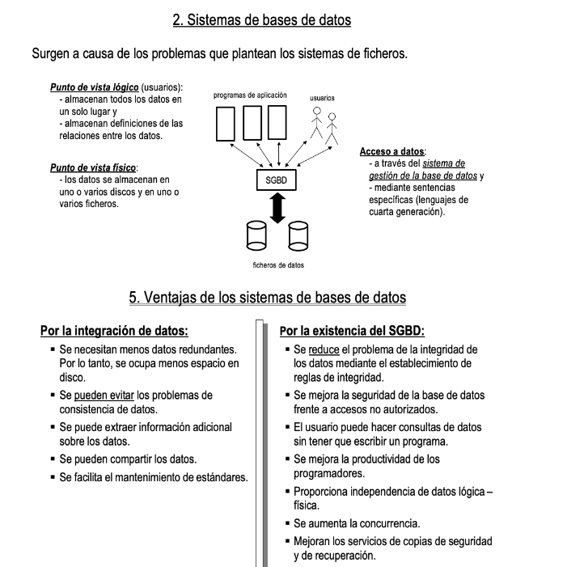

Introducción a base de datos (SQL y NoSQL)
https://www.youtube.com/watch?v=8K1PKSqHFRQ

## SGBD

El sistema de gestión de la base de datos (en adelante SGBD) es una aplicación que permite a los usuarios definir, crear y mantener la base de datos, además de proporcionar un acceso controlado a la misma. Se denomina sistema de bases de datos al conjunto formado por la base de datos, el SGBD y los programas de aplicación que dan servicio a la empresa u organización. El modelo seguido con los sistemas de bases de datos, en donde se separa la definición de los datos de los programas de aplicación, es muy similar al modelo que se sigue en la actualidad para el desarrollo de programas con lenguajes orientados a objetos, en donde se da una definición interna de un objeto y una definición externa separada. Los usuarios del objeto sólo ven la definición externa y no se deben preocupar de cómo se define internamente el objeto y ni cómo está implementado. Una ventaja de este modelo, conocido como abstracción de datos, es que se puede cambiar la definición interna de un objeto sin afectar a sus usuarios ya que la definición externa no se ve alterada. Del mismo modo, los sistemas de bases de datos separan la definición de la estructura de los datos, de los programas de aplicación y almacenan esta definición en la base de datos. Si se añaden nuevas estructuras de datos o se modifican las ya existentes, los programas de aplicación no se ven afectados si no dependen directamente de aquello que se ha modificado. Todo esto es gracias a la existencia del SGBD, que se sitúa entre la base de datos y los programas de aplicación.



## 🧩 Clasificación de comandos SQL
1. DDL – Data Definition Language (Lenguaje de definición de datos)
Se usa para crear o modificar la estructura de las bases de datos (tablas, columnas, índices, etc.)

| Comando    | Descripción                                              |
| ---------- | -------------------------------------------------------- |
| `CREATE`   | Crea objetos como tablas, vistas, índices, etc.          |
| `ALTER`    | Modifica la estructura de una tabla u otro objeto        |
| `DROP`     | Elimina un objeto (tabla, vista, etc.)                   |
| `TRUNCATE` | Borra todos los datos de una tabla, sin registro de undo |
| `RENAME`   | Cambia el nombre de un objeto                            |


2. DML – Data Manipulation Language (Lenguaje de manipulación de datos)
Se usa para modificar o consultar los datos dentro de las tablas.

| Comando  | Descripción                            |
| -------- | -------------------------------------- |
| `SELECT` | Recupera datos desde una o más tablas  |
| `INSERT` | Inserta nuevas filas en una tabla      |
| `UPDATE` | Modifica datos existentes en una tabla |
| `DELETE` | Elimina filas específicas de una tabla |


3. DCL – Data Control Language (Lenguaje de control de acceso)
Se usa para gestionar permisos y seguridad en la base de datos.

| Comando  | Descripción                                     |
| -------- | ----------------------------------------------- |
| `GRANT`  | Otorga permisos a usuarios o roles              |
| `REVOKE` | Revoca (quita) permisos anteriormente otorgados |

4. TCL – Transaction Control Language

| Comando           | Descripción                                                            |
| ----------------- | ---------------------------------------------------------------------- |
| `COMMIT`          | Guarda de manera permanente los cambios realizados en la base de datos |
| `ROLLBACK`        | Deshace todos los cambios realizados en la transacción actual          |
| `SAVEPOINT`       | Crea un punto de restauración dentro de una transacción                |
| `SET TRANSACTION` | Modifica el modo de una transacción (aislación, nombre, etc.)          |


https://livesql.oracle.com/next/

## DML


### Actividad: SQL Intro - DML
Usando Customer Order (CO), llevar a cabo comandos SQL (DML):

1. Conseguir este resultado:


2. Mostrar el ID,  nombre y web address de cada STORES. Mostrar solo los que tengan un URL.
3. Mostrar todos los clientes, ordenados por su nombre en ordén alfabético.
4. Mostrar los datos del client con id 5.
5. Mostrar su nombre y correo solamente, en una columna, en el siguiente format: "email - nombre"
6. Mostrar os datos de los clientes 5, 6, 7 o 8.
7. ¿Cuántos clientes hay?
8. Mostrar todos los orders (pedidos) con los de cliente 1 primero.
9. ¿El cliente 3 ha cancelado alguna vez un pedido? ¿Y el cliente 1?
10. Para el cliente 5, mostrar sus pedidos en el siguiente formato:


11. Mostrar 10 últimos los pedidos en la tabla de ORDERS.
12. Mostrar los pedidos para cliente 3. Además, mostrar el nombre de la tienda donde la ha comprado.
13. Ahora, mostrar su nombre tambien en el resultado (el resultado deberia incluir el nombre de cliente, su pedidio y el nombre de la tienda)


## DDL - CREATE

```sql
-- primera clase
create table table1 (
    id number primary key,
    nombre varchar2(100),
    edad number
)

-- Intro 
CREATE TABLE productos (
  id NUMBER GENERATED ALWAYS AS IDENTITY PRIMARY KEY,
  nombre VARCHAR2(100) NOT NULL,
  precio NUMBER(10,2) NOT NULL,
  stock NUMBER DEFAULT 0,
  fecha_agregado DATE DEFAULT SYSDATE
);


select * from user_tables
select * from user_tab_columns;
select * from user_users

-- practicar INSERT, UPDATE, DELETE

INSERT INTO productos (nombre, precio, stock, fecha_agregado)
VALUES ('Aceite de oliva virgen', 9.75, 15, TO_DATE('2025-04-15', 'YYYY-MM-DD'));


CREATE TABLE productos (
  id NUMBER PRIMARY KEY,
  nombre VARCHAR2(100) NOT NULL,
  precio NUMBER(10,2) NOT NULL,
  stock NUMBER DEFAULT 0,
  fecha_agregado DATE DEFAULT SYSDATE
);

CREATE SEQUENCE productos_seq
  START WITH 1         
  INCREMENT BY 1  

INSERT INTO productos (id, nombre, precio, stock, fecha_agregado)
VALUES (productos_seq.NEXTVAL, 'Aceite de oliva virgen', 9.75, 15, TO_DATE('2025-04-15', 'YYYY-MM-DD'));

SELECT * FROM user_sequences;


```
Preparar la base de datos con los siguientes datos de la tienda de Zara:

Producto: Blusa
Precio: 29.99
Stock: 50
Fecha agregado: 2025-04-01

Producto: Pantalón de lino
Precio: 39.99
Stock: 30
Fecha agregado: 2025-03-15

Producto: Chaqueta
Precio: 99.99

Producto: Vestido
Precio: 59.50
Stock: 40
Fecha agregado: 2025-04-05

Producto: Camiseta básica
Precio: 14.99
Stock: 100


### Actividades DDL
Con la tabla de usuarios, crear comandos SQL para llevar a cabo las operaciones CRUD (Insert, Update, Delete, Select):

CREATE TABLE usuarios (
    id            NUMBER PRIMARY KEY,
    nombre          VARCHAR2(100), -- Text data type for names
    edad           NUMBER, -- Numeric data type for age
    fecha_de_comienzo     DATE, -- Date data type for hire date
    salario        NUMBER(10, 2), -- Numeric data type for salary with precision and scale
    activo        CHAR(1), -- Character data type for a flag (Y/N)
    dirrecion       VARCHAR2(255), -- Text data type for the address
    ultima_acualizacion  TIMESTAMP DEFAULT CURRENT_TIMESTAMP -- Timestamp for last updated date
);

### Actividad DDL

A partir de Oracle 12c, puedes usar columnas IDENTITY para simular el comportamiento de autoincremento.


```sql
CREATE TABLE miembros (
  id NUMBER GENERATED BY DEFAULT ON NULL AS IDENTITY PRIMARY KEY,  -- ID único para cada miembro
  nombre VARCHAR2(255) NOT NULL,                                   -- Nombre del miembro
  email VARCHAR2(255) UNIQUE NOT NULL,                             -- Correo electrónico único
  telefono VARCHAR2(50),                                           -- Número de teléfono
  fecha_registro DATE NOT NULL,                                    -- Fecha de registro del miembro
  tipo_membresia VARCHAR2(100) NOT NULL,                           -- Tipo de membresía (Ej: Mensual, Anual)
  fecha_expiracion DATE,                                           -- Fecha de expiración de la membresía
  ultima_asistencia DATE,                                          -- Fecha de la última vez que asistió al gimnasio
  activo NUMBER(1) DEFAULT 1 NOT NULL                              -- Estado si el miembro está activo (1 = activo, 0 = inactivo)
);
```

Trabajas como administrador de la base de datos en un gimnasio. Durante el dia, estas recibiendo muchos correos. Crear los comandos SQL para introducir los datos basado en la información que te llega desde el buzón de correo:

---
Asunto: Solicitud de alta en el gimnasio

Hola,

Soy Ana Martínez y deseo registrarme como miembro del gimnasio. A continuación, te dejo mis datos:

- Correo electrónico: ana.martinez@email.com
- Teléfono: No proporcionado
- Fecha de registro: 1 de febrero de 2025
- Tipo de membresía: Anual
- Fecha de expiración: 1 de febrero de 2026

Gracias, espero su respuesta.

Atentamente,
Ana Martínez


---
Asunto: Solicitud de alta en el gimnasio
Hola,

Mi nombre es Carlos Pérez y me gustaría registrarme como nuevo miembro en el gimnasio. Mi correo electrónico es carlos.perez@email.com y mi número de teléfono es 555-1234. Quiero registrarme el 10 de enero de 2025 y mi tipo de membresía sería mensual, con fecha de expiración el 10 de febrero de 2025. La última vez que asistí al gimnasio fue el 20 de enero de 2025, y deseo mantener mi estado como activo. Quedo a la espera de su confirmación.

Saludos cordiales,
Carlos Pérez


---
Hola,

Soy Carlos Pérez. Me gustaría actualizar la fecha de mi última asistencia al gimnasio. La nueva fecha es:

- Nueva fecha de última asistencia: 25 de enero de 2025

Gracias por gestionar la actualización.

Saludos cordiales,
Carlos Pérez

--- 

Asunto: Solicitud de baja del gimnasio

Hola,

Mi nombre es Ana Martínez y me gustaría solicitar la baja de mi membresía en el gimnasio. Mi correo electrónico es ana.martinez@email.com. Agradecería que procedieran con la cancelación de mi cuenta y me confirmaran cuando haya sido completada. Lamento tener que dar este paso, pero espero poder volver en el futuro.

Gracias de antemano por su atención.

Atentamente,
Ana Martínez
---


### 📚 Diccionario de Datos de Oracle
El diccionario de datos en Oracle es un conjunto de vistas que proporcionan metadatos sobre los objetos de la base de datos. Es decir, describe cómo están estructurados los datos y los objetos dentro de la base de datos (tablas, vistas, índices, usuarios, etc.). Los metadatos son información sobre los datos que te ayuda a entender la estructura y las características de los objetos en la base de datos sin modificar su contenido.

El diccionario de datos es dinámico, lo que significa que está actualizado en tiempo real con la información de la base de datos. Está compuesto por vistas, no tablas físicas, que se utilizan para consultar esta información.

🔑 Componentes del Diccionario de Datos
El diccionario de datos se organiza en diferentes categorías de vistas, dependiendo de qué información deseas obtener y qué privilegios tienes. Las vistas se dividen principalmente en tres grupos:

1. Vistas del Usuario (USER_ views)
Estas vistas contienen información solo sobre los objetos que son propiedad del usuario actual. Es decir, muestran los objetos que el usuario ha creado o posee.

Ejemplos de vistas:

USER_TABLES: Muestra información sobre las tablas que posee el usuario.

USER_TAB_COLUMNS: Muestra detalles sobre las columnas de las tablas que el usuario posee.

USER_VIEWS: Muestra información sobre las vistas que el usuario posee.

USER_INDEXES: Muestra información sobre los índices que el usuario ha creado.

2. Vistas de Todos (ALL_ views)
Estas vistas contienen información sobre todos los objetos a los que el usuario actual tiene acceso, incluyendo objetos de otros usuarios. No solo muestra los objetos que son propiedad del usuario, sino también aquellos a los que tiene permisos de acceso.

Ejemplos de vistas:

ALL_TABLES: Muestra información sobre todas las tablas a las que el usuario tiene acceso.

ALL_TAB_COLUMNS: Muestra detalles sobre las columnas de todas las tablas accesibles por el usuario.

ALL_INDEXES: Muestra información sobre los índices a los que el usuario tiene acceso.

ALL_VIEWS: Muestra información sobre las vistas a las que el usuario tiene acceso.

3. Vistas del DBA (DBA_ views)
Estas vistas contienen información sobre todos los objetos en la base de datos, y generalmente solo pueden ser consultadas por usuarios con privilegios de DBA (Administrador de Base de Datos). Los DBA utilizan estas vistas para gestionar y supervisar todos los objetos de la base de datos.

Ejemplos de vistas:

DBA_TABLES: Muestra información sobre todas las tablas en la base de datos.

DBA_TAB_COLUMNS: Muestra detalles sobre las columnas de todas las tablas en la base de datos.

DBA_USERS: Muestra información sobre todos los usuarios de la base de datos.

DBA_OBJECTS: Muestra información sobre todos los objetos en la base de datos.

4. Vistas de Información (V$ views)
Estas vistas proporcionan información dinámica en tiempo real sobre el estado de la base de datos. Generalmente se utilizan para monitoreo y diagnóstico de la base de datos.

Ejemplos de vistas:

V$SESSION: Muestra información sobre las sesiones activas en la base de datos.

V$DATABASE: Proporciona información sobre la base de datos actual.

V$PARAMETER: Muestra los parámetros de configuración actuales de la base de datos.


## Actividad: SQL Intro - DDL


https://www.youtube.com/watch?v=knVwokXITGI&t=105s (casa)


https://www.youtube.com/watch?v=iRYwDh_o8hE (Admministrador de base de datos)

https://es.khanacademy.org/computing/computer-programming/sql/relational-queries-in-sql/pt/joining-related-tables

https://gestionbasesdatos.readthedocs.io/es/latest/index.html#

El modelo entidad relación (E/R) proporciona una herramienta para representar información del mundo real a nivel conceptual. Creado en 1976 por Peter Chen, permite describir las entidades involucradas en una base de datos, así como las relaciones y restricciones de ellas.
Notación gráfica.
Tiene semántica clara.
Fácil de entender a un por no especialistas.
Independiente de cualquier SGBD.


Base de datos online
https://www.lucidchart.com/pages/es/herramienta-ERD
https://www.youtube.com/watch?v=TKuxYHb-Hvc
Online editor de base de datos
https://app.sqldbm.com/
UPV videos
https://www.youtube.com/watch?v=-tuDXYWn3fQ
https://www.youtube.com/watch?v=THyQ-hhuOx4
https://www.youtube.com/watch?v=_SADhrQD5bY
Normalización
https://www.youtube.com/watch?v=bO18omSzeR4
Manual de clases
https://jorgesanchez.net/manuales/gbd/sgbd.html


## Respuestas

```sql
SELECT order_id AS Pedido_ID, to_char(order_tms, 'YYYY') AS Pedido_Año, to_char(order_tms, 'MONTH') AS Pedido_Mes FROM Co.orders
where customer_id = 5;

SELECT *
from co.orders
order by order_tms DESC
fetch first 5 rows only;


SELECT o.order_id, o.order_status, s.store_id, store_name
from co.orders o
JOIN co.stores s ON o.store_id = s.store_id
where customer_id = 3;

SELECT c.full_name, o.order_id, o.order_status, s.store_id, store_name
from co.orders o
INNER JOIN co.stores s ON o.store_id = s.store_id
INNER JOIN co.customers c ON c.customer_id = o.customer_id
where o.customer_id = 3;
```