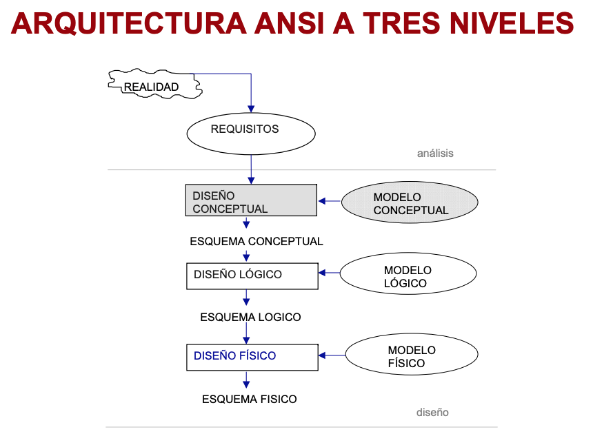
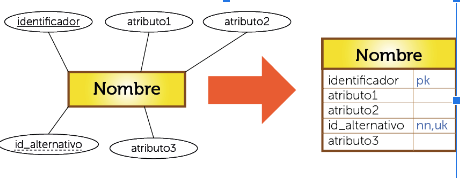
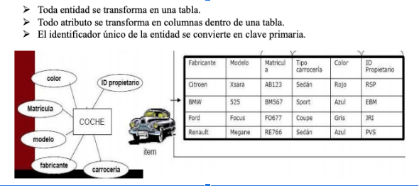

# Diagrama ER (Entidad-Relación)

El modelo entidad relación (E/R) proporciona una herramienta para representar información del mundo real a nivel conceptual. Creado en 1976 por Peter Chen, permite describir las entidades involucradas en una base de datos, así como las relaciones y restricciones de ellas.
- Notación gráfica.
- Tiene semántica clara.
- Fácil de entender a un por no especialistas.
- Independiente de cualquier SGBD.

## Actividades
Dibuja un diagrama entidad-relación para mostrar cómo se relacionan las siguientes dominios:

Imagina que tienes que crear una base de datos para un biblioteca. Necesitas representar los libros y autores. Cada libro tiene un título y un año de publicación. Hay más atributos que quieres guardar?
 Cada autor tiene un nombre. ¿Cuantos libros puede escribir un autor? 

En un colegio hay muchos alumnos. ¿Cuántos alumnos puede haber en un colegio? ¿Qué atributos tiene un alumno? ¿Y el colegio?

Imagina que tienes que crear una base de datos para una agencia de viajes. Necesitas representar los viajeros y sus pasaportes. Cada viajero tiene un nombre, una fecha de nacimiento y una nacionalidad. ¿Qué datos tendrá una pasaporte? ¿Cuántos pasaportes puede tener un viajero? ¿Un pasaporte puede pertenecer a varios viajeros?

Imagina que tienes que crear una base de datos para gestionar un equipo Scrum en una empresa de desarrollo ágil. ¿Cuál es la relación entre el equipo de Scrum y las tareas del Sprint? ¿Qué atribitos guardarás?

Imagina que tienes que crear una base de datos para una tienda de ropa en línea. Necesitas representar los productos y los clientes. Cada producto tiene un nombre, un precio y una categoría (como camisetas, pantalones, etc.). ¿Qué otros atributos podrías agregar para un producto? Cada cliente tiene un nombre y una dirección de envío. ¿Cuántos productos puede comprar un cliente? ¿Un producto puede ser comprado por varios clientes?

Imagina que tienes que crear una base de datos para un sitio de recetas de cocina. Necesitas representar los ingredientes y las recetas. Cada ingrediente tiene un nombre y una cantidad. Cada receta tiene un nombre, una descripción y un tiempo de preparación. ¿Cuántos ingredientes puede tener una receta? ¿Un ingrediente puede aparecer en varias recetas?

## Proyecto: Sistema de Gestión de Restaurante
Imagina que tienes que crear una base de datos para gestionar las operaciones de un restaurante. El sistema permite administrar los menús, reservas, pedidos de los clientes, y empleados.

## Más recursos
- https://aunclicdedistancia.wordpress.com/2015/01/29/pasar-del-modelo-entidad-relacion-al-modelo-relacional/
- https://www.fca.unl.edu.ar/agromatica/Docs/09-ModeloEntRel.PDF

Diseño de base de datos relacional:
- https://www.youtube.com/watch?v=-tuDXYWn3fQ
- https://www.youtube.com/watch?v=THyQ-hhuOx4
- https://www.youtube.com/watch?v=_SADhrQD5bY

https://www.youtube.com/watch?v=TKuxYHb-Hvc (Luci Chart)

# La normalización
La normalización es un proceso clave en el diseño de bases de datos que ayuda a garantizar la eficiencia, integridad y organización de los datos. Sin embargo, es importante equilibrar la normalización con las necesidades de rendimiento de las consultas y la simplicidad del modelo de datos, ya que en algunos casos una normalización excesiva puede hacer que el sistema sea más difícil de manejar

Ventajas de la Normalización
Reducción de redundancia: Al separar los datos en diferentes tablas, se minimiza la repetición de la misma información.

Mejora en la integridad de los datos: La normalización asegura que los datos se almacenan de manera consistente, evitando problemas de datos inconsistentes o erróneos.

Optimización en el mantenimiento: Si los datos están normalizados, es más fácil actualizar y mantener la base de datos, ya que se evita la duplicación de datos.

Desventajas de la Normalización
Complejidad: Las tablas pueden ser más complejas y pueden requerir más uniones (joins) en las consultas, lo que puede afectar el rendimiento.

Costos de consultas: A medida que se normalizan más los datos, las consultas pueden volverse más lentas debido a la necesidad de combinar múltiples tablas a través de uniones.

## Actividades

¿Que problemas tiene estas tablas? ¿Cómo las normalizarías?

Tabla: pedidos

| id_pedido | cliente | productos              |
|-----------|---------|------------------------|
| 1         | Ana     | Pan, Leche, Huevos     |
| 2         | Luis    | Arroz                  |

Tabla: empleados

| id_empleado | nombre | fechas_vacaciones         |
|-------------|--------|---------------------------|
| 1           | Carla  | 2024-07-01, 2024-07-15     |
| 2           | Pedro  | 2024-08-10                |

Tabla: curso_profesor, con la clave primaria compuesta por id_curso y id_estudiante.

| id_curso | id_estudiante | nombre_profesor |
|----------|---------------|-----------------|
| 101      | 1             | Prof. García    |
| 101      | 2             | Prof. García    |
| 102      | 1             | Prof. López     |

Tabla: estudiantes_cursos con la clave primaria de id_estudiante.

| id_estudiante | nombre_estudiante | id_curso | nombre_curso | nombre_profesor |
|---------------|-------------------|----------|--------------|-----------------|
| 1             | Ana               | 101      | Matemáticas  | Prof. García    |
| 2             | Luis              | 102      | Historia     | Prof. López     |

Tabla: productos_proveedores, con la clave primaria de id_producto.

| id_producto | nombre_producto | id_proveedor | nombre_proveedor | direccion_proveedor |
|-------------|-----------------|--------------|------------------|---------------------|
| 101         | Teclado         | 1001         | Proveedor A      | Calle A, 123       |
| 102         | Ratón           | 1002         | Proveedor B      | Calle B, 456       |

## Respuestas

| id_empleado | nombre | fecha_vacacion  |
|-------------|--------|-----------------|
| 1           | Carla  | 2024-07-01       |
| 1           | Carla  | 2024-07-15       |
| 2           | Pedro  | 2024-08-10       |

# SGBD
https://jorgesanchez.net/manuales/gbd/sgbd.html