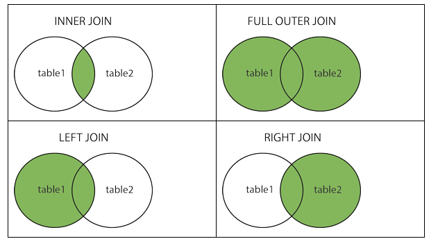
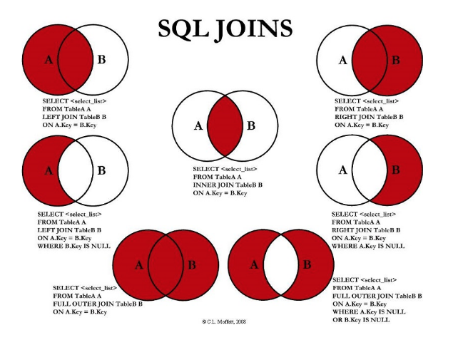

# Joins






```sql
-- Crear tabla de alumnos
CREATE TABLE alumnos (
    id_alumno INT PRIMARY KEY,
    nombre TEXT
);

-- Crear tabla de cursos
CREATE TABLE cursos (
    id_curso INT PRIMARY KEY,
    nombre_curso TEXT,
    id_alumno INT
);

-- Insertar datos en alumnos
INSERT INTO alumnos (id_alumno, nombre) VALUES
(1, 'Ana'),
(2, 'Luis'),
(3, 'Carlos'),
(4, 'Marta');

-- Insertar datos en cursos
INSERT INTO cursos (id_curso, nombre_curso, id_alumno) VALUES
(101, 'Matemáticas', 1),
(102, 'Historia', 2),
(103, 'Física', 2),
(104, 'Química', 5);  -- Este alumno no existe

```

Ejemplos de JOINS
```sql
-- INNER JOIN: solo los alumnos con cursos válidos
SELECT a.nombre, c.nombre_curso
FROM alumnos a
INNER JOIN cursos c ON a.id_alumno = c.id_alumno;

-- LEFT JOIN: todos los alumnos, aunque no tengan cursos
SELECT a.nombre, c.nombre_curso
FROM alumnos a
LEFT JOIN cursos c ON a.id_alumno = c.id_alumno;

-- RIGHT JOIN: todos los cursos, aunque no tengan un alumno válido
SELECT a.nombre, c.nombre_curso
FROM alumnos a
RIGHT JOIN cursos c ON a.id_alumno = c.id_alumno;

-- FULL JOIN: todos los alumnos y todos los cursos
SELECT a.nombre, c.nombre_curso
FROM alumnos a
FULL JOIN cursos c ON a.id_alumno = c.id_alumno;
```

## Actividades

