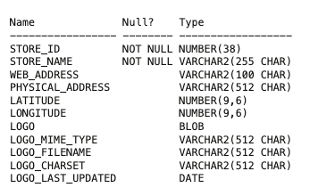
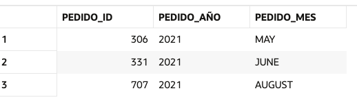

Introducción a base de datos (SQL y NoSQL)
https://www.youtube.com/watch?v=8K1PKSqHFRQ

## 🧩 Clasificación de comandos SQL
1. DDL – Data Definition Language (Lenguaje de definición de datos)
Se usa para crear o modificar la estructura de las bases de datos (tablas, columnas, índices, etc.)

| Comando    | Descripción                                              |
| ---------- | -------------------------------------------------------- |
| `CREATE`   | Crea objetos como tablas, vistas, índices, etc.          |
| `ALTER`    | Modifica la estructura de una tabla u otro objeto        |
| `DROP`     | Elimina un objeto (tabla, vista, etc.)                   |
| `TRUNCATE` | Borra todos los datos de una tabla, sin registro de undo |
| `RENAME`   | Cambia el nombre de un objeto                            |


2. DML – Data Manipulation Language (Lenguaje de manipulación de datos)
Se usa para modificar o consultar los datos dentro de las tablas.

| Comando  | Descripción                            |
| -------- | -------------------------------------- |
| `SELECT` | Recupera datos desde una o más tablas  |
| `INSERT` | Inserta nuevas filas en una tabla      |
| `UPDATE` | Modifica datos existentes en una tabla |
| `DELETE` | Elimina filas específicas de una tabla |


3. DCL – Data Control Language (Lenguaje de control de acceso)
Se usa para gestionar permisos y seguridad en la base de datos.

| Comando  | Descripción                                     |
| -------- | ----------------------------------------------- |
| `GRANT`  | Otorga permisos a usuarios o roles              |
| `REVOKE` | Revoca (quita) permisos anteriormente otorgados |

4. TCL – Transaction Control Language

| Comando           | Descripción                                                            |
| ----------------- | ---------------------------------------------------------------------- |
| `COMMIT`          | Guarda de manera permanente los cambios realizados en la base de datos |
| `ROLLBACK`        | Deshace todos los cambios realizados en la transacción actual          |
| `SAVEPOINT`       | Crea un punto de restauración dentro de una transacción                |
| `SET TRANSACTION` | Modifica el modo de una transacción (aislación, nombre, etc.)          |


https://livesql.oracle.com/next/

## DML


### Actividad: SQL Intro - DML
Usando Customer Order (CO), llevar a cabo comandos SQL (DML):

1. Conseguir este resultado:



2. Mostrar el ID,  nombre y web address de cada STORES. Mostrar solo los que tengan un URL.
3. Mostrar todos los clientes, ordenados por su nombre en ordén alfabético.
4. Mostrar los datos del client con id 5.
5. Mostrar su nombre y correo solamente, en una columna, en el siguiente format: "email - nombre"
6. Mostrar os datos de los clientes 5, 6, 7 o 8.
7. ¿Cuántos clientes hay?
8. Mostrar todos los orders (pedidos) con los de cliente 1 primero.
9. ¿El cliente 3 ha cancelado alguna vez un pedido? ¿Y el cliente 1?
10. Para el cliente 5, mostrar sus pedidos en el siguiente formato:



11. Mostrar 10 últimos los pedidos en la tabla de ORDERS.
12. Mostrar los pedidos para cliente 3. Además, mostrar el nombre de la tienda donde la ha comprado.
13. Ahora, mostrar su nombre tambien en el resultado (el resultado deberia incluir el nombre de cliente, su pedidio y el nombre de la tienda)


## DDL


select * from user_tables
select * from user_tab_columns;
select * from user_users

create table table1 (
    id number primary key,
    nombre varchar2(100),
    edad number
)


### Actividades DDL
Con la tabla de usuarios, crear comandos SQL para llevar a cabo las operaciones CRUD (Insert, Update, Delete, Select):

CREATE TABLE usuarios (
    id            NUMBER PRIMARY KEY,
    nombre          VARCHAR2(100), -- Text data type for names
    edad           NUMBER, -- Numeric data type for age
    fecha_de_comienzo     DATE, -- Date data type for hire date
    salario        NUMBER(10, 2), -- Numeric data type for salary with precision and scale
    activo        CHAR(1), -- Character data type for a flag (Y/N)
    dirrecion       VARCHAR2(255), -- Text data type for the address
    ultima_acualizacion  TIMESTAMP DEFAULT CURRENT_TIMESTAMP -- Timestamp for last updated date
);


### 📚 Diccionario de Datos de Oracle
El diccionario de datos en Oracle es un conjunto de vistas que proporcionan metadatos sobre los objetos de la base de datos. Es decir, describe cómo están estructurados los datos y los objetos dentro de la base de datos (tablas, vistas, índices, usuarios, etc.). Los metadatos son información sobre los datos que te ayuda a entender la estructura y las características de los objetos en la base de datos sin modificar su contenido.

El diccionario de datos es dinámico, lo que significa que está actualizado en tiempo real con la información de la base de datos. Está compuesto por vistas, no tablas físicas, que se utilizan para consultar esta información.

🔑 Componentes del Diccionario de Datos
El diccionario de datos se organiza en diferentes categorías de vistas, dependiendo de qué información deseas obtener y qué privilegios tienes. Las vistas se dividen principalmente en tres grupos:

1. Vistas del Usuario (USER_ views)
Estas vistas contienen información solo sobre los objetos que son propiedad del usuario actual. Es decir, muestran los objetos que el usuario ha creado o posee.

Ejemplos de vistas:

USER_TABLES: Muestra información sobre las tablas que posee el usuario.

USER_TAB_COLUMNS: Muestra detalles sobre las columnas de las tablas que el usuario posee.

USER_VIEWS: Muestra información sobre las vistas que el usuario posee.

USER_INDEXES: Muestra información sobre los índices que el usuario ha creado.

2. Vistas de Todos (ALL_ views)
Estas vistas contienen información sobre todos los objetos a los que el usuario actual tiene acceso, incluyendo objetos de otros usuarios. No solo muestra los objetos que son propiedad del usuario, sino también aquellos a los que tiene permisos de acceso.

Ejemplos de vistas:

ALL_TABLES: Muestra información sobre todas las tablas a las que el usuario tiene acceso.

ALL_TAB_COLUMNS: Muestra detalles sobre las columnas de todas las tablas accesibles por el usuario.

ALL_INDEXES: Muestra información sobre los índices a los que el usuario tiene acceso.

ALL_VIEWS: Muestra información sobre las vistas a las que el usuario tiene acceso.

3. Vistas del DBA (DBA_ views)
Estas vistas contienen información sobre todos los objetos en la base de datos, y generalmente solo pueden ser consultadas por usuarios con privilegios de DBA (Administrador de Base de Datos). Los DBA utilizan estas vistas para gestionar y supervisar todos los objetos de la base de datos.

Ejemplos de vistas:

DBA_TABLES: Muestra información sobre todas las tablas en la base de datos.

DBA_TAB_COLUMNS: Muestra detalles sobre las columnas de todas las tablas en la base de datos.

DBA_USERS: Muestra información sobre todos los usuarios de la base de datos.

DBA_OBJECTS: Muestra información sobre todos los objetos en la base de datos.

4. Vistas de Información (V$ views)
Estas vistas proporcionan información dinámica en tiempo real sobre el estado de la base de datos. Generalmente se utilizan para monitoreo y diagnóstico de la base de datos.

Ejemplos de vistas:

V$SESSION: Muestra información sobre las sesiones activas en la base de datos.

V$DATABASE: Proporciona información sobre la base de datos actual.

V$PARAMETER: Muestra los parámetros de configuración actuales de la base de datos.


## Actividad: SQL Intro - DDL


https://www.youtube.com/watch?v=knVwokXITGI&t=105s (casa)


https://www.youtube.com/watch?v=iRYwDh_o8hE

https://es.khanacademy.org/computing/computer-programming/sql/relational-queries-in-sql/pt/joining-related-tables

https://gestionbasesdatos.readthedocs.io/es/latest/index.html#

El modelo entidad relación (E/R) proporciona una herramienta para representar información del mundo real a nivel conceptual. Creado en 1976 por Peter Chen, permite describir las entidades involucradas en una base de datos, así como las relaciones y restricciones de ellas.
Notación gráfica.
Tiene semántica clara.
Fácil de entender a un por no especialistas.
Independiente de cualquier SGBD.


Base de datos online
https://www.lucidchart.com/pages/es/herramienta-ERD
https://www.youtube.com/watch?v=TKuxYHb-Hvc
Online editor de base de datos
https://app.sqldbm.com/
UPV videos
https://www.youtube.com/watch?v=-tuDXYWn3fQ
https://www.youtube.com/watch?v=THyQ-hhuOx4
https://www.youtube.com/watch?v=_SADhrQD5bY
Normalización
https://www.youtube.com/watch?v=bO18omSzeR4
Manual de clases
https://jorgesanchez.net/manuales/gbd/sgbd.html


## Respuestas

```sql
SELECT order_id AS Pedido_ID, to_char(order_tms, 'YYYY') AS Pedido_Año, to_char(order_tms, 'MONTH') AS Pedido_Mes FROM Co.orders
where customer_id = 5;

SELECT *
from co.orders
order by order_tms DESC
fetch first 5 rows only;


SELECT o.order_id, o.order_status, s.store_id, store_name
from co.orders o
JOIN co.stores s ON o.store_id = s.store_id
where customer_id = 3;

SELECT c.full_name, o.order_id, o.order_status, s.store_id, store_name
from co.orders o
INNER JOIN co.stores s ON o.store_id = s.store_id
INNER JOIN co.customers c ON c.customer_id = o.customer_id
where o.customer_id = 3;
```