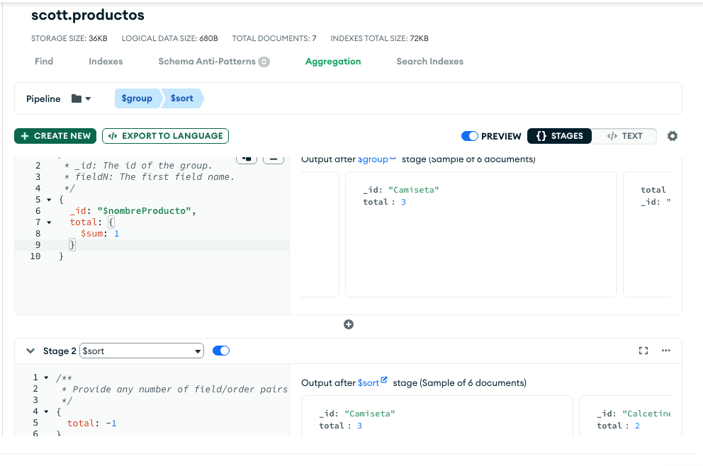
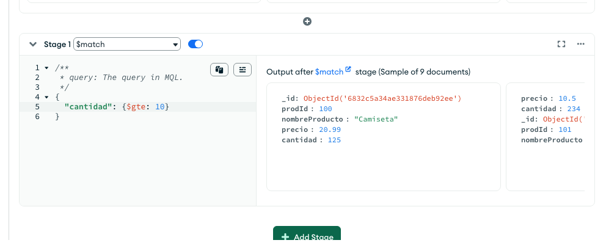

# Agregaciones / Aggregations

**¿Qué es un pipeline de agregación en MongoDB?**
Un pipeline de agregación es una secuencia de etapas (o pasos) que se aplican sobre los documentos de una colección, uno tras otro, para transformar y procesar los datos hasta obtener el resultado que quieres.

Piensa en un pipeline como una fábrica o una tubería donde:
- Cada etapa hace un trabajo específico:
filtrar, agrupar, ordenar, modificar, etc.

- Los datos pasan por cada etapa en orden.

- El resultado de una etapa es la entrada de la siguiente.

```sql
SELECT deptno, COUNT(*) 
FROM employees 
GROUP BY deptno;
```

```js
db.employees.aggregate([
  { $group: { _id: "$deptno", count: { $sum: 1 } } }
]);
```

## Pista!
Atributos va en este formato:
```js
"$cantidad"
```

Mientras operaciones y funciones va en este formato:
```js

$sum, $multiply, $avg

// por ejemplo:
{ $sum: "$cantidad" }
```

## Ejemplo con mongodb en Node
Usar client-test-conn.js para probarlo.

```js
const database = client.db("clase");
const productos = database.collection("productos");


const pipeline = [
    {
    '$count': 'total'
    }
];

const result = await productos.aggregate(pipeline).toArray();

console.log(result[0]?.total ?? 0);

```


## Group by
Para este demo, agregar (clonar) mas documentos para cada producto. Por ejemplo, para que haya 3 pantalones, etc...

```sql
SELECT nombreProducto, COUNT(*) AS total
FROM products
GROUP BY nombreProducto
ORDER BY total DESC
```


En la consola de Atlas, escribimos un stage 1 de $group, y luego agregamos un stage de $sort.

```js
{
  _id: "$nombreProducto",
  total: {
    $sum: 1
  }
}
```



# WHERE
OJO - aplicar MQL (Mongo Query Language)





## Project
Vamos a aplicar un calculo al resultado, en la fase de $project. Aunque si se puede hacerlo en una fase, seria mejor separar las fases.
```js
[
  {
    $group:
      /**
       * _id: The id of the group.
       * fieldN: The first field name.
       */
      {
        _id: "$nombreProducto",
        totalProductos: {
          $sum: "$precio",
        },
      },
  },
  {
    $project:
      /**
       * specifications: The fields to
       *   include or exclude.
       */
      {
        totalProductos: {
          $add: ["$totalProductos", 100],
        },
      },
  },
]
```


## Actividades

Buscar ($match) los documentos con el precio menos o igual a 15 euros. Ahora, contar ($count) el número de productos en total con el precio igual o menos a 15 euros.


Convertir esta búsqueda en un $match con agregación:
```js
db.collection.find({ nombreProducto: { $in: ["Camiseta", "Pantalón"] } })
```


Queremos conseguir los siguientes resultados en una aplicacion de consola de Node:
```js
[
  { _id: 'Camiseta', total_cantidad: 375 },
  { _id: 'Pantalón', total_cantidad: 234 },
  { _id: 'Chaqueta', total_cantidad: 432 },
  { _id: 'Zapatos', total_cantidad: 320 },
  { _id: 'Calcetines', total_cantidad: 200 },
  { _id: 'Clone', total_cantidad: 111 }
]
```


## Respuestas

```js
{
  _id: "$nombreProducto",
  total_cantidad: {
    $sum: "$cantidad"
  }
}


[
  {
    $match:
      /**
       * query: The query in MQL.
       */
      {
        precio: {
          $lte: 16.1,
        },
      },
  },
  {
    $count:
      /**
       * Provide the field name for the count.
       */
      "totalProductos",
  },
]
```