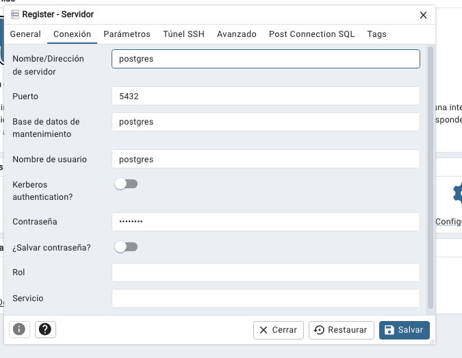

# Postgres

https://hub.docker.com/_/postgres

```
docker compose up -d
o
docker-compose up -d
```


docker-compose ps

docker-compose logs

docker-compose down

Acceder a pgAdmin a través de:
http://localhost:5050/



Conectar a la base de datos:

```bash
docker exec -it postgres-db bash
```
Navegar al directorio `/var/lib/postgresql/data` y echar un vistazo a los archivos.

