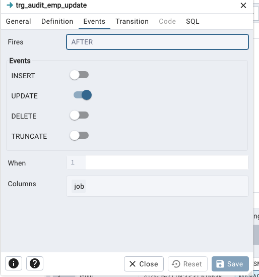

# rules - not available in sql server


# triggers

Vamos a empezar con un ejemplo para auditar
```sql

CREATE TABLE IF NOT EXISTS scott.audit
(
    ename character varying COLLATE pg_catalog."default",
    action_time timestamp without time zone
)


CREATE OR REPLACE FUNCTION scott.audit_emp_insert()
RETURNS TRIGGER AS $$
BEGIN
    INSERT INTO scott.audit(ename, action_time)
    VALUES (NEW.ename, now());
    RETURN NEW;
END;
$$ LANGUAGE plpgsql;

select *  FROM pg_catalog.pg_proc
where proname LIKE 'audi%';


CREATE TRIGGER trg_audit_emp_insert
AFTER INSERT ON scott.emp
FOR EACH ROW
EXECUTE FUNCTION scott.audit_emp_insert();

```


Ejemplo, modificamos la tabla y añadimos una columna de 'job'. Modificamos la funcion para que scott.audit_emp_update() y colocamos la funcion en un trigger de UPDATE que dispare solo para la columna 'job' de la tabla emp.




Ejemplo de Validación antes de insertar

Queremos evitar que el usuario introducza un valor de NULO en el campo 'dname':

```sql
INSERT INTO scott.dept (deptno, dname, loc)
VALUES (300, NULL, 'SS')


-- cuerpo de la funcion
BEGIN
  IF NEW.dname IS NULL THEN
    RAISE EXCEPTION 'Name cannot be null';
  END IF;
  
  -- Return NEW to proceed with the update using this new row data
  RETURN NEW;
END;


```


## Actividades

TO DO !!!!! MAS faciles para empezar


**Avanzado**
Teniendo una table de auditar para lo departamentos, queremos mantener la historial de cambios:

```sql
-- Tabla para auditoría de cambios en departamento
CREATE TABLE IF NOT EXISTS scott.dept_audit (
    audit_id SERIAL PRIMARY KEY,
    deptno INTEGER,
    old_dname VARCHAR(14),
    new_dname VARCHAR(14),
    old_loc VARCHAR(13),
    new_loc VARCHAR(13),
    change_time TIMESTAMP DEFAULT now()
);
```

Insertar los cambios de OLD y NEW en los respectivos campos al ejecutar un UPDATE.

## Respuestas

```sql


-- Función trigger para registrar cambios
CREATE OR REPLACE FUNCTION scott.log_dept_changes()
RETURNS TRIGGER AS $$
BEGIN
    -- Solo registrar si hay cambios en dname o loc
    IF OLD.dname IS DISTINCT FROM NEW.dname OR OLD.loc IS DISTINCT FROM NEW.loc THEN
        INSERT INTO scott.dept_audit(deptno, old_dname, new_dname, old_loc, new_loc)
        VALUES (OLD.deptno, OLD.dname, NEW.dname, OLD.loc, NEW.loc);
    END IF;
    RETURN NEW;
END;
$$ LANGUAGE plpgsql;

-- Crear el trigger AFTER UPDATE
CREATE TRIGGER trg_dept_log_changes
AFTER UPDATE ON scott.dept
FOR EACH ROW
EXECUTE FUNCTION scott.log_dept_changes();


```