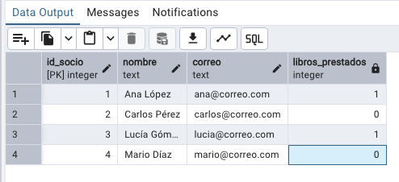
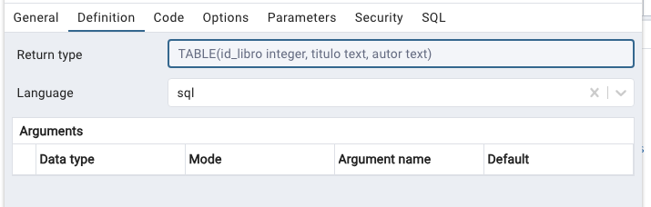
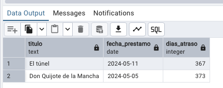

```sql
CREATE SCHEMA IF NOT EXISTS biblioteca;


CREATE TABLE biblioteca.socios (
    id_socio SERIAL PRIMARY KEY,
    nombre TEXT NOT NULL,
    correo TEXT UNIQUE NOT NULL
);

CREATE TABLE biblioteca.libros (
    id_libro SERIAL PRIMARY KEY,
    titulo TEXT NOT NULL,
    autor TEXT NOT NULL
);

CREATE TABLE biblioteca.prestamos (
    id_prestamo SERIAL PRIMARY KEY,
    id_socio INT REFERENCES biblioteca.socios(id_socio),
    id_libro INT REFERENCES biblioteca.libros(id_libro),
    fecha_prestamo DATE NOT NULL,
    fecha_devolucion DATE
);

-- Socios
INSERT INTO biblioteca.socios (nombre, correo) VALUES
('Ana López', 'ana@correo.com'),         -- Ha hecho préstamos
('Carlos Pérez', 'carlos@correo.com'),   -- Ha hecho préstamos
('Lucía Gómez', 'lucia@correo.com'),     -- Ha hecho préstamos
('Mario Díaz', 'mario@correo.com');      -- NO ha hecho ningún préstamo

-- Libros
INSERT INTO biblioteca.libros (titulo, autor) VALUES
('Cien años de soledad', 'Gabriel García Márquez'),  -- Prestado
('El túnel', 'Ernesto Sabato'),                      -- Prestado
('Don Quijote de la Mancha', 'Miguel de Cervantes'), -- Prestado
('Rayuela', 'Julio Cortázar');                       -- NO ha sido prestado

-- Préstamos
INSERT INTO biblioteca.prestamos (id_socio, id_libro, fecha_prestamo, fecha_devolucion) VALUES
(1, 1, '2024-05-01', '2024-05-10'), -- Ana -> Cien años
(1, 2, '2024-05-11', NULL),         -- Ana -> El túnel
(2, 1, '2024-05-03', '2024-05-12'), -- Carlos -> Cien años
(3, 3, '2024-05-05', NULL);         -- Lucía -> Don Quijote


```

---
## PARTE 1

Llevar a cabo lo siguiente:


1. Queremos saber si hay socios que aún no han realizado préstamos. Mostrar solo el socio que no ha realizado un préstamo.

2. Muestra una lista de todos los préstamos, incluyendo el nombre del socio, el título del libro y la fecha del préstamo.

3. Queremos saber qué libros han sido prestados y cuáles no.

4. Queremos saber qué libros estan actualmente prestados y a qué socio están prestados. 
    Crear una vista llamada "vw_libros_prestados" para esta consulta, dandole permisos de lectura a la aplicacion de Python para sacar los informes.

5. Añadir unos nuevos libros a la tabla libros. Escribir el código SQL.
   'Ana Lopez' ha prestado dos libros más. Escribir el código SQL para insertar su prestámo.
   Hoy, "Lucía Gómez" ha devuleto su libro	"Don Quijote de la Mancha". Escribir el código SQL.

6.  Queremos saber cuántos libros prestados tiene cada socio actualmente. Si el valor es mayor a 3, mostrar los resultados. Si es menos de 3, no hay ningun problema, asi que no les mostramos.
    De nuevo, Crear una vista llamada "vw_libros_prestados_importantes" para esta consulta, dandole permisos de lectura a la aplicacion de Python para sacar los informes.


## PARTE 2 

1. Aprovechando una funcion, crear una consulta para mostrar el siguiente resultado. La última columna mostrará el total de libros que tiene prestado cada socio. 




2. Socio 'Ana Lopez' ha vuelto a pedir prestado 'Cien años de soledad'. Insertar este prestamo.
Ahora, queremos saber un historial de todos los libros que ha prestado a lo largo de su vida. Mostrar la lista de libros solamente, creando una funcion para ello. Pista: Usar DISTINCT para evitar duplicados.

USAR 'TABLE (id_libro INT, titulo TEXT, autor TEXT)' como return type custom.




3. Avanzado




## Respuestas

```sql
-- Parte 1
-- 1.
SELECT * 
FROM biblioteca.socios s
	LEFT JOIN biblioteca.prestamos p ON p.id_socio = s.id_socio
	WHERE id_prestamo IS NULL
--2. 

SELECT s.nombre, l.titulo, p.fecha_prestamo
FROM biblioteca.prestamos p
INNER JOIN biblioteca.socios s ON p.id_socio = s.id_socio
INNER JOIN biblioteca.libros l ON p.id_libro = l.id_libro;

--3.
SELECT * 
FROM biblioteca.libros l
	LEFT JOIN biblioteca.prestamos p ON p.id_libro = l.id_libro
	WHERE id_prestamo IS NULL


--4.
SELECT p.id_prestamo, s.nombre, l.titulo, p.fecha_prestamo, p.fecha_devolucion
FROM biblioteca.prestamos p
JOIN biblioteca.socios s ON p.id_socio = s.id_socio
JOIN biblioteca.libros l ON p.id_libro = l.id_libro
WHERE p.fecha_devolucion IS NULL;

--5.
SELECT p.id_socio, COUNT (p.id_libro) AS libros_prestados
FROM biblioteca.prestamos p
WHERE fecha_devolucion IS NOT NULL
GROUP BY p.id_socio, fecha_devolucion
HAVING COUNT(p.id_libro) >= 1 


-- Part 2:

SELECT *
    FROM biblioteca.prestamos
    WHERE id_socio = 2
      AND fecha_devolucion IS NULL;

SELECT *, biblioteca.get_num_prestado(id_socio) AS libros_prestados 
FROM biblioteca.socios 


-- avanzado
SELECT l.titulo,
        p.fecha_prestamo,
        (CURRENT_DATE - p.fecha_prestamo - 7) AS dias_atraso
    FROM biblioteca.prestamos p
    JOIN biblioteca.libros l ON p.id_libro = l.id_libro
    WHERE 
       p.fecha_devolucion IS NULL
      AND CURRENT_DATE - p.fecha_prestamo > 7;
```