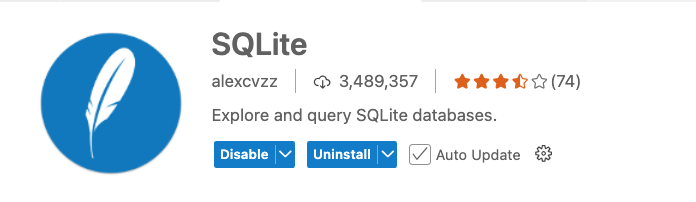

# SQLite
https://sqlite.org/



SQLite Browser:
- https://sqliteviewer.app/
- https://beta.sqliteviewer.app/
- https://chromewebstore.google.com/detail/visualizador-de-base-de-d/iclckldkfemlnecocpphinnplnmijkol
- https://workspace.google.com/marketplace/app/sqlite_viewer_with_google_drive/298830041920?hl=es

Docker:
https://hub.docker.com/r/keinos/sqlite3


## Actividad - miembros de un gimnasio
El objectivo de esta tarea es construir unos comandos de SQL (DML) para generar 2 informes para un gimnasio, sobre sus miembros o socios. Al hacerlo, habrá que cargar la base de datos con datos de usuarios (INSERT).


```sql
-- Tabla de miembros del gimnasio
CREATE TABLE miembros (
  id INTEGER PRIMARY KEY AUTOINCREMENT,  -- ID único para cada miembro
  nombre TEXT NOT NULL,                  -- Nombre del miembro
  email TEXT UNIQUE NOT NULL,            -- Correo electrónico único
  telefono TEXT,                         -- Número de teléfono
  fecha_registro DATE NOT NULL,          -- Fecha de registro del miembro
  tipo_membresia TEXT NOT NULL,          -- Tipo de membresía (Ej: Mensual, Anual)
  fecha_expiracion DATE,                 -- Fecha de expiración de la membresía
  ultima_asistencia DATE,                -- Fecha de la última vez que asistió al gimnasio
  activo BOOLEAN NOT NULL DEFAULT 1      -- Estado si el miembro está activo (1 = activo, 0 = inactivo)
);
```

Crear un sistema para sacar 2 informes usando comandos de SQL a partir de la tabla de miembros.

Informe de miembros activos e inactivos:
- Mostrar los miembros que están activos y los que están inactivos (según el campo activo).

Informe de miembros que no han asistido en un mes:
- Mostrar los miembros cuya ultima_asistencia es anterior a un mes (considerando la fecha actual).


## Actividad - completa
Hacer un ReactJS interfaz para la gestion de los informes y los miembros con sqlite.


## Actividad - IoT con VITE

02-SmartDoor.jsx (plantilla)

La idea es que cada usuario pasa su identidad, y el sistema le da acceso a la puerta del gimnasio. El usuario puede introducir su identidad (numero de miembro) en un formulario, y un RESTAPI comprobará si el usuario tiene acceso o no. Si tiene acceso, se abre la puerta (se enciende un LED verde), y si no tiene acceso, se enciende un LED rojo.  Además, se guardará un registro de la fecha y hora de la apertura de la puerta en una base de datos SQLite en el **navegador**.

Partes:
- ReactJS (frontend) - VITE (formulario de acceso, botones, LEDs)
- RESTAPI (backend) - ExpressJS (comprobar acceso, abrir puerta)
- SQLite (base de datos en el navegador para guardar el registro de acceso (fecha y hora, abrir, cerrar))

Creamos un nuevo proyecto de ReactJS "iot-react-sql" usando vite@latest, que esta más actualizado que CRA (create-react-app).

Seleccionar React, Javascript durante la instalación.

```bash
npm create vite@latest iot-react-sql --template react
cd iot-react-sql
npm install
npm install sql.js
npm run dev
```


---

## Respuestas

```js

import express from 'express';
import cors from 'cors';
import {
  createTable,
  addUser,
  listUsers,
  updateUser,
  deleteUser,
} from './userModel.js';

const app = express();
const port = 4000;

createTable();
app.use(cors());
app.use(express.json());

// GET all users
app.get('/users', (req, res) => {
  listUsers((err, users) => {
    if (err) return res.status(500).send(err.message);
    res.json(users);
  });
});

// POST add user
app.post('/users', (req, res) => {
  const { name, email } = req.body;
  addUser(name, email, (err, id) => {
    if (err) return res.status(400).send(err.message);
    res.json({ id });
  });
});

// PUT update user
app.put('/users/:id', (req, res) => {
  const { name } = req.body;
  updateUser(req.params.id, name, (err, changes) => {
    if (err) return res.status(400).send(err.message);
    res.json({ updated: changes });
  });
});

// DELETE user
app.delete('/users/:id', (req, res) => {
  deleteUser(req.params.id, (err, changes) => {
    if (err) return res.status(400).send(err.message);
    res.json({ deleted: changes });
  });
});

app.listen(port, () => {
  console.log(`API listening at http://localhost:${port}`);
});

```


```sql
SELECT id, nombre, email, ultima_asistencia
FROM miembros
WHERE ultima_asistencia < DATE('now', '-1 month') OR ultima_asistencia IS NULL;
```

---


```js

export function buscarProductos(nombre) {
  return new Promise((resolve, reject) => {
    db.all(`SELECT * FROM productos WHERE nombre LIKE ?`, [`%${nombre}%`], (err, rows) => {
      if (err) return reject(err);
      resolve(rows);
    });
  });
}

export function productosBajoStock(threshold = 5) {
  return new Promise((resolve, reject) => {
    db.all(`SELECT * FROM productos WHERE stock < ?`, [threshold], (err, rows) => {
      if (err) return reject(err);
      resolve(rows);
    });
  });
}
```