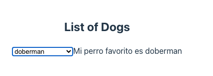
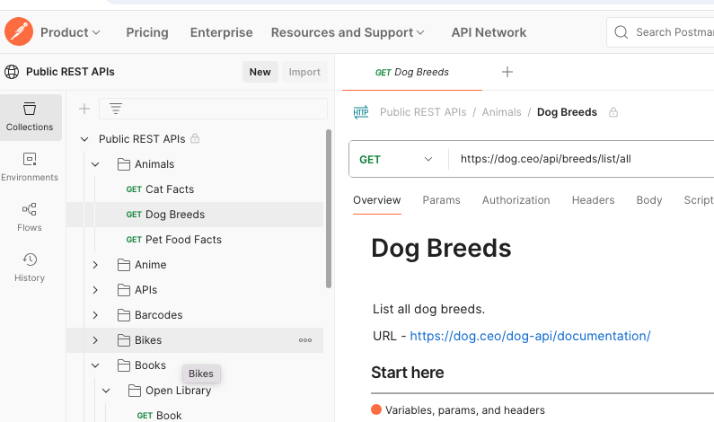
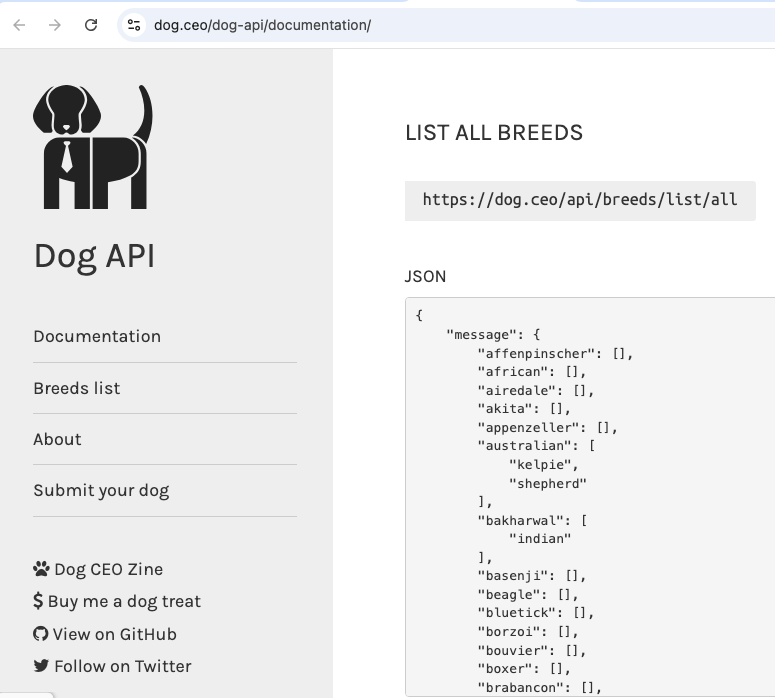

https://apilayer.com/
https://github.com/public-apis/public-apis

https://www.postman.com/cs-demo/public-rest-apis/request/xkhk1up/search


https://opendata.euskadi.eus/apis/-/apis-open-data/

render.com for deployment


## Actividades
### Dogs
https://dog.ceo/dog-api/documentation/

Vamos a añadir funcionalidad para seleccionar la un perro y mostrar su valor. Hacer los cambios necesarios a la página de ReactJS:
- usar un <select>
- aplicar un event handler onChange del select
- al final, podrias modificar el código para seleccionar múltiples perros a la vez: <select multiple?
- Pista, usar este código en el evento handler:
const arrSelected = Array.from(event.target.selectedOptions, x=> x.value);








```jsx

import { useEffect, useState } from 'react';

function Dogs() {
  const [dogs, setDogs] = useState([]);

  useEffect(() => {
    const fetchDogs = () => {
      fetch(`https://dog.ceo/api/breeds/list/all`)
        .then(res => {
          if (!res.ok) {
            throw new Error(`Failed to fetch dogs: ${res.status}`);
          }
          return res.json();
        })
        .then(data => {
          const topLevelBreeds = Object.keys(data.message);
          setDogs(topLevelBreeds);
          console.log('Dog breeds:', topLevelBreeds);
        })
        .catch(err => {
          console.error(`Error fetching dogs:`, err);
        });
    };

    fetchDogs();
  }, []);

  return (
    <div>
      <h2>List of Dogs</h2>
      <ul>
        {dogs.map((breed, index) => (
          <li key={index}>{breed}</li>
        ))}
      </ul>
    </div>
  );
}

export default Dogs;
```

### SLA - Service Level Agreement
SLA (Acuerdo de Nivel de Servicio)

Ejercicio: Redactar un SLA para una API de Estudiantes
Contexto del ejercicio:
Imagina que tú y tu equipo han desarrollado una API REST que ofrece datos de mascotas (perros, gatos, etc.). Quieren publicarla para que otros estudiantes la usen en sus apps. Pero antes, necesitan escribir un Acuerdo de Nivel de Servicio (SLA) que describa qué promete el equipo.

🎯 Objetivo:
Redactar un SLA básico (1 página) que defina:

- Qué ofrece su API

- Qué nivel de servicio garantizan

- Qué pasa si algo falla

🧩 Desafíos incluidos:
**Disponibilidad**

¿Cuántas horas por semana estará disponible su API?

Si usan Render, Vercel u otro servicio gratuito, ¿deberían prometer 24/7?

**Velocidad de respuesta**

¿Cuánto tiempo máximo debe tardar la API en responder?

¿Y si el servidor está dormido (como en servicios gratuitos)?

**Soporte técnico**

¿Quién del equipo responde dudas o errores?

¿Dónde se deben reportar problemas? ¿Por email, Discord, GitHub Issues?

**Límites de uso (rate limits)**

¿Van a permitir llamadas ilimitadas?

¿Qué pasa si alguien hace 5000 llamadas en una hora?

**Actualizaciones y cambios**

¿Cómo avisarán a los usuarios si cambian el formato de los datos o eliminan un endpoint?


## Respuestas
```jsx
import { useEffect, useState } from 'react';

function Dogs() {
  const [dogs, setDogs] = useState([]);
  const [selectedDog, setSelectedDog] = useState('');

  useEffect(() => {
    const fetchDogs = () => {
      fetch(`https://dog.ceo/api/breeds/list/all`)
        .then(res => {
          if (!res.ok) {
            throw new Error(`Failed to fetch dogs: ${res.status}`);
          }
          return res.json();
        })
        .then(data => {
          const topLevelBreeds = Object.keys(data.message);
          setDogs(topLevelBreeds);
          console.log('Dog breeds:', topLevelBreeds);
        })
        .catch(err => {
          console.error(`Error fetching dogs:`, err);
        });
    };

    fetchDogs();
  }, []);

  const handleChange = (event) => {
      console.log(event.target.value);
      setSelectedDog(event.target.value);
  }

  return (
    <div>
      <h2>List of Dogs</h2>
      <select onChange={handleChange}>
        {dogs.map((breed, index) => (
          <option value={breed}>{breed}</option>
        ))}
      </select>

      Mi perro favorito es {selectedDog}
    </div>
  );
}

export default Dogs;


const arrSelected = Array.from(event.target.selectedOptions, x=> x.value);
```
